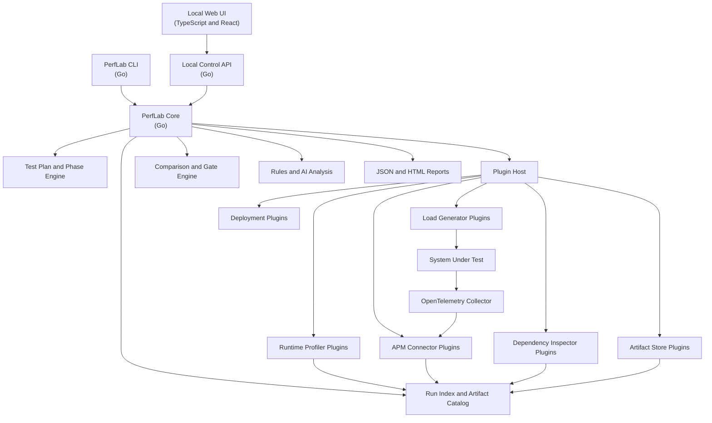
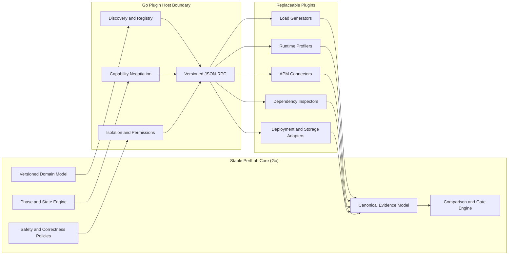
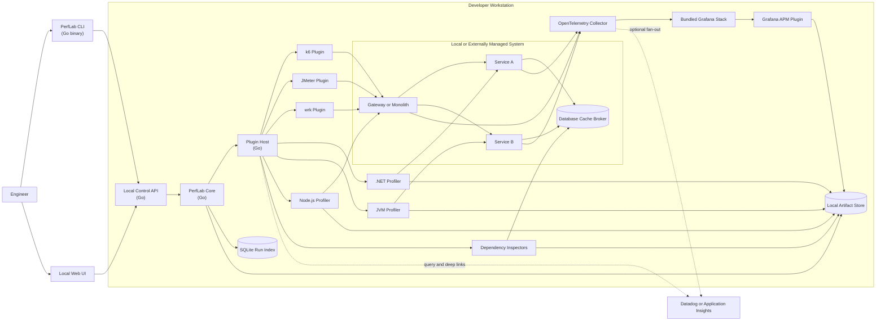
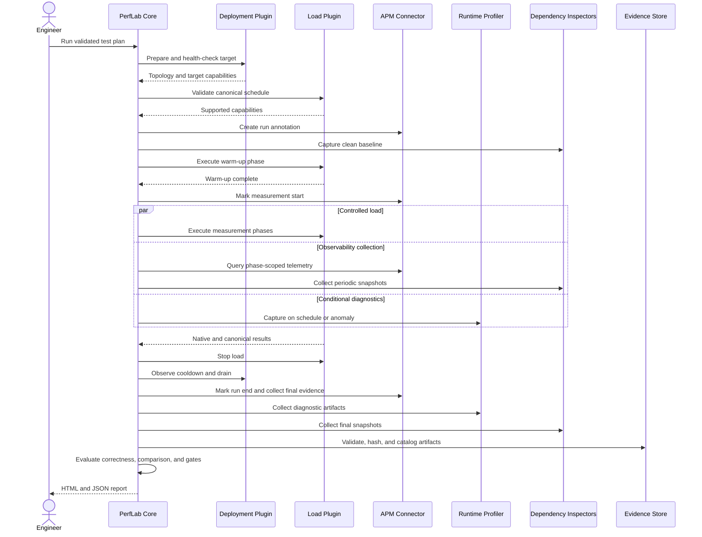
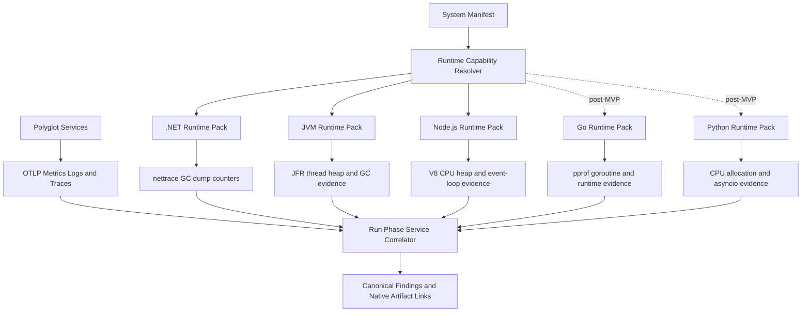
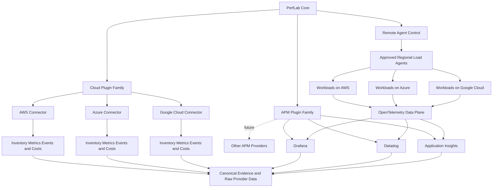

# PerfLab Product and Local MVP Plan

Status: Product proposal
Primary objective: Evolve the current .NET performance lab into a pluggable,
language-neutral, local-first performance engineering platform.

## 1. Product thesis

PerfLab should let a team describe a system once, reuse its business journeys
across multiple performance-test types, attach the appropriate load generators,
APM systems, dependency collectors, and language-specific profilers, and receive
a repeatable evidence package, comparison, and diagnosis.

The current .NET commerce application remains valuable, but it becomes a sample
system, training environment, and plugin conformance fixture. It must not remain
coupled to the product core.

The product should support three operating modes:

1. **Managed local lab**: PerfLab starts a sample or user-owned Docker Compose
   system and its observability stack.
2. **External target**: PerfLab drives an already running local, test, or staging
   system without owning its deployment.
3. **Agent mode**: A PerfLab agent runs near a private or remote target and is
   controlled by the CLI/control plane. This is post-MVP, but the protocol must
   allow it from the beginning.

## 2. MVP outcome

The MVP must run entirely on a developer workstation without requiring a cloud
account or commercial SaaS subscription. It must demonstrate that the product
is not tied to one load generator, one runtime, one application architecture,
or one observability backend.

The MVP is complete when a user can:

- install and run a Go-based CLI, local control API, plugin host, and agent as
  versioned cross-platform product binaries;
- define a monolith or multi-service system in a versioned manifest;
- define reusable HTTP/API business journeys and correctness checks;
- execute smoke, baseline/load, stress, spike, soak, and breakpoint profiles;
- select k6, JMeter, or wrk when the requested load model is supported;
- profile .NET, JVM, and Node.js services in one local run;
- collect evidence from the bundled Grafana stack, Datadog, or Azure
  Monitor/Application Insights;
- correlate the load phase, service telemetry, dependency evidence, and runtime
  profiles under one run ID;
- compare a candidate run with a compatible baseline;
- enforce correctness and performance gates;
- produce a self-contained local HTML and JSON report;
- install or update a plugin without recompiling the PerfLab core.

Go and Python **target runtime packs** are the first post-MVP additions. This is
separate from using Go to implement the PerfLab product core. Their profiler
designs are included in this plan so the MVP abstractions do not block them.

## 3. MVP scope matrix

| Capability | MVP support | Immediately after MVP |
|---|---|---|
| Product implementation | Go CLI, core, plugin host, local API, and local agent; TypeScript local UI | Same Go agent running remotely; hosted control plane as a later deployment option |
| Target architectures | Monolith, statically described microservices, HTTP plus asynchronous messaging | Discovered Kubernetes topology, serverless, multi-region |
| Deployment | Docker Compose and externally managed URL/service | Kubernetes, VM/SSH, cloud-managed deployment |
| Load generators | k6, JMeter, wrk | Locust, Gatling, Vegeta, browser providers |
| Runtime packs | .NET, JVM/Java, Node.js | Go, Python, native/eBPF |
| APM connectors | Bundled Grafana stack, Datadog, Azure Monitor/Application Insights | New Relic, Dynatrace, Elastic, AppDynamics, Splunk, Google Cloud Operations, AWS CloudWatch/X-Ray |
| Dependencies | PostgreSQL, Redis, RabbitMQ, generic HTTP | SQL Server, MySQL, MongoDB, Kafka, cloud-managed services |
| Artifact storage | Local filesystem with SQLite run index | S3-compatible, Azure Blob, Google Cloud Storage |
| User interface | CLI plus local read-only run/report UI | Multi-user control plane, RBAC, scheduling UI |
| Analysis | Deterministic calculations/rules plus optional AI provider | Organization rule packs, capacity forecasting, fleet-wide trends |
| Execution | Single-machine load generation | Distributed load agents and multiple regions |

## 4. Design principles

1. **Stable core, pluggable integrations**: orchestration and result semantics
   stay in the core; vendor and runtime behavior stays in plugins.
2. **Out-of-process plugins**: plugins are not limited to .NET assemblies and a
   failed plugin cannot crash the orchestrator.
3. **Raw plus normalized evidence**: retain native artifacts while producing a
   canonical result suitable for comparisons.
4. **Capability negotiation**: reject unsupported experiments rather than
   silently changing their traffic model or diagnostic method.
5. **Correctness before speed**: a run with incorrect responses or lost business
   outcomes cannot pass a performance gate.
6. **Exact phase correlation**: setup, warm-up, measurement, diagnostic,
   cooldown, and drain are distinct, timestamped phases.
7. **Local first, remote capable**: no cloud dependency in the MVP, but the same
   contracts must support remote agents later.
8. **APM-friendly, not APM-replacing**: use a customer's existing APM when one
   exists and provide a bundled local stack when it does not.
9. **Safe by default**: bounded load, explicit target allowlists, read-only
   integrations by default, secret references, and an emergency stop.
10. **Reproducible experiments**: protocol version, source/build identity,
    environment fingerprint, exact workload, and evidence completeness are part
    of every run.

### 4.1 Preferred implementation language and stack

The PerfLab product core is a greenfield implementation. The existing C# API
and worker are systems under test and .NET runtime-pack fixtures; they are not
the reusable orchestration core. The preferred product implementation is:

| Product component | Preferred technology | Reason |
|---|---|---|
| CLI | Go | Cross-platform executable, strong process control, suitable for CI and developer workstations |
| Core orchestrator | Go | Concurrency, cancellation, networking, long-running run-state coordination |
| Plugin host | Go | Low-overhead supervision of executables and containers |
| Local control API | Go | Reuses the same domain and run-state implementation as the CLI |
| Local and future remote agent | Go | One implementation from workstation through container/Kubernetes deployment |
| Local UI | TypeScript and React | Browser ecosystem and separation from the control plane |
| Local metadata index | SQLite | Zero-configuration local persistence |
| Local plugin protocol | Versioned JSON-RPC plus NDJSON events over standard I/O | Simple cross-language executable/container integration |
| Remote-agent protocol | Protobuf and gRPC | Typed streaming, deadlines, cancellation, and multi-language SDK generation |
| Application telemetry | OpenTelemetry and OTLP | Language- and vendor-neutral signal transport |

The public contracts never expose Go types. JSON Schema, JSON-RPC, Protobuf,
OpenAPI, OTLP, and canonical artifact schemas are the compatibility boundary.
A plugin can be written in Go, C#, Java, Python, Node.js, Rust, or any other
language, or delivered entirely as a container.

The existing .NET projects move conceptually under `samples/dotnet-commerce`
and serve as:

- the .NET reference target;
- the first runtime-profiler conformance fixture;
- the controlled performance-defect training lab;
- a regression suite for evidence capture and analysis.

Go is selected for the product core because local distribution, low-overhead
agents, process/container orchestration, concurrent streaming, and future
Kubernetes/cloud execution are primary product concerns. C# remains a valid
plugin or target implementation language, but existing target code is not a
reason to couple the core to .NET.

## 5. Logical architecture



### 5.1 Core responsibilities

The core owns:

- project, environment, system, test-plan, and run models;
- phase scheduling and state transitions;
- cancellation, retries, timeouts, and cleanup coordination;
- workload and diagnostic correlation IDs;
- correctness and performance gates;
- canonical evidence and artifact metadata;
- baseline compatibility and statistical comparison;
- plugin discovery, capability resolution, and health monitoring;
- report generation and audit history.

The core must not contain k6 parsing, JFR commands, Datadog queries, PostgreSQL
SQL, or other technology-specific behavior.

### 5.2 Stable core and plugin ownership

This boundary prevents integrations from leaking vendor-specific behavior into
the core while keeping experiment semantics consistent across plugins.



### 5.3 Local MVP deployment and data flow

All required control, load, telemetry, evidence, and reporting components run
locally. External APM connectors are optional and do not prevent an offline
Grafana-backed run.



### 5.4 Run orchestration sequence

The phase engine coordinates integrations; plugins never independently decide
when a measurement starts or ends.



### 5.5 Polyglot runtime and telemetry correlation

OpenTelemetry provides the cross-language request path, while each runtime pack
adds native evidence that would be lost in a lowest-common-denominator format.



## 6. Core domain model

```text
Project
  -> Environment
      -> SystemDefinition
          -> Service
          -> Dependency
          -> Operation/Journey
      -> TestPlan
          -> Workload
          -> LoadProfile
          -> Phase
          -> CorrectnessGate
          -> PerformanceGate
      -> Run
          -> PhaseExecution
          -> Signal
          -> Artifact
          -> Finding
          -> Comparison
```

Every schema has an `apiVersion`. A run records the exact schema and plugin API
versions used so older evidence remains readable.

## 7. Plugin architecture

### 7.1 Plugin types

| Plugin type | Responsibility | MVP implementations |
|---|---|---|
| Load generator | Validate, translate, execute, and stop a canonical load schedule | k6, JMeter, wrk |
| Runtime profiler | Discover a process and capture runtime-specific diagnostics | .NET, JVM, Node.js |
| APM connector | Export/query telemetry, create annotations, and generate deep links | Grafana, Datadog, Application Insights |
| Dependency inspector | Capture dependency-specific state and performance evidence | PostgreSQL, Redis, RabbitMQ, HTTP/socket |
| Deployment adapter | Start, stop, discover, and health-check a target | Docker Compose, external target |
| Artifact store | Store and retrieve immutable run artifacts | Local filesystem |
| Analyzer | Produce findings from canonical and raw evidence | Built-in rules, optional AI provider |
| Reporter | Render canonical run and comparison models | JSON, self-contained HTML, JUnit summary |

### 7.2 Process boundary and protocol

Plugins run as executables or containers. The MVP uses a versioned JSON-RPC
protocol over standard input/output for commands and NDJSON for progress events.
This keeps local execution simple and allows plugins to be implemented in any
language. A future remote agent can expose the same logical contract over gRPC.

The minimum lifecycle is:

```text
Handshake
GetCapabilities
ValidateConfiguration
PrepareRun
StartPhase
UpdateLoad                  optional capability
CollectSnapshot             optional capability
StopPhase
CollectArtifacts
Cleanup
Health
```

All commands carry a deadline, cancellation token identifier, run ID, phase ID,
working directory, and secret references. Plugins emit structured progress,
warnings, errors, metrics, and artifact declarations.

### 7.3 Plugin manifest

```yaml
apiVersion: perflab.io/plugin/v1alpha1
kind: Plugin
metadata:
  id: perflab.load.k6
  version: 0.1.0
spec:
  type: load-generator
  runtime: executable
  entrypoint: perflab-load-k6
  configSchema: schemas/config.json
  permissions:
    network: target-only
    filesystem: run-directory
  capabilities:
    loadModels:
      - closed-concurrency
      - open-arrival-rate
      - ramping-arrival-rate
    dynamicLoadUpdate: true
    distributedExecution: false
    protocols:
      - http
      - https
```

### 7.4 Capability negotiation

The plan compiler converts a user-facing test profile into a canonical load
schedule and asks the selected plugin whether it can execute that schedule.

Examples:

- k6 can support closed and open arrival-rate workloads.
- JMeter can support thread/concurrency-oriented workloads and selected
  throughput schedules.
- wrk supports lightweight fixed-concurrency HTTP throughput but not rich user
  journeys, browser execution, or dynamic open-model scheduling.

If a plan requests a capability that a plugin cannot provide, validation fails
before the system is placed under load. Approximation is permitted only when the
user explicitly selects it, and the deviation is recorded in the manifest.

### 7.5 Plugin packaging and installation

The MVP supports:

- an executable bundle with manifest, schemas, and checksums;
- a container image with an immutable digest;
- built-in official plugin metadata shipped with the CLI;
- a local plugin registry under the user's PerfLab data directory;
- `install`, `remove`, `list`, `inspect`, `doctor`, and `upgrade` operations.

A public marketplace is not required for MVP. The protocol and package format
must nevertheless support official, private, and future community plugins.

### 7.6 Plugin security

The host enforces:

- isolated per-run working directories;
- declared filesystem, network, Docker, and process permissions;
- secret handles rather than secret values in plans or artifacts;
- process timeouts, cancellation, and output-size limits;
- CPU and memory limits for containerized plugins;
- structured logs with redaction;
- plugin checksums and trust level;
- cleanup after failure or cancellation;
- no cloud or deployment mutation without a separate approved capability.

### 7.7 Conformance kit

The SDK includes:

- protocol schemas and generated client/server models;
- a fake core for plugin developers;
- lifecycle, cancellation, timeout, and malformed-output tests;
- golden load-result and profile-artifact fixtures;
- compatibility tests across plugin API versions;
- a certification report displayed by `plugins inspect`.

Adding JMeter after extracting k6/wrk and adding JVM profiling after extracting
.NET profiling are mandatory architecture tests: a plugin abstraction is not
accepted until at least two materially different implementations use it.

## 8. System definition

A system manifest describes the system independently of a workload:

```yaml
apiVersion: perflab.io/v1alpha1
kind: System
metadata:
  name: commerce-local
spec:
  deployment:
    plugin: perflab.deploy.compose
    composeFile: compose.yaml

  services:
    - name: gateway
      runtime: nodejs
      endpoint: http://127.0.0.1:8080
      health: /health/ready
      profiler: auto
    - name: catalog
      runtime: java
      profiler: auto
    - name: orders
      runtime: dotnet
      profiler: auto

  dependencies:
    - name: orders-db
      type: postgresql
      inspector: perflab.dependency.postgresql
    - name: cache
      type: redis
      inspector: perflab.dependency.redis
    - name: order-bus
      type: rabbitmq
      inspector: perflab.dependency.rabbitmq

  telemetry:
    transport: otlp
    apm: perflab.apm.grafana
```

MVP topology is declared statically and enriched with observed OpenTelemetry
service edges. Kubernetes and cloud discovery can later generate or update the
same canonical system model.

## 9. Workloads and test plans

Business journey logic is separated from its load profile. A checkout journey
can therefore run as smoke, average load, stress, spike, soak, or breakpoint
without duplicating the journey implementation.

```yaml
apiVersion: perflab.io/v1alpha1
kind: TestPlan
metadata:
  name: checkout-soak
spec:
  systemRef: commerce-local
  protocolVersion: local-v1

  workloads:
    - name: checkout
      journey: journeys/checkout.yaml
      weight: 70
    - name: browse
      journey: journeys/browse.yaml
      weight: 30

  load:
    generator: perflab.load.k6
    model: open-arrival-rate
    profile:
      type: soak
      phases:
        - { name: warmup, duration: 10m, rate: 25/s }
        - { name: steady, duration: 8h, rate: 100/s }
        - { name: cooldown, duration: 10m, rate: 0/s }

  gates:
    correctness:
      - expression: response.success_rate == 1
      - expression: orders.reconciled == true
    performance:
      - expression: http.latency.p95 < 400ms
      - expression: http.error_rate < 0.5%
      - expression: process.memory.steady_slope < 20MiB/hour
      - expression: queue.drains_within < 5m

  diagnostics:
    periodicSnapshots: 15m
    captureOnAnomaly: true
```

Journey definitions support setup data, parameterization, request groups,
correlation, think time, response validation, cleanup, and asynchronous outcome
validation. Load-generator plugins translate the canonical journey when
possible or accept a native script reference as an escape hatch.

Native scripts remain supported, but their limitations and non-portable
features are recorded in the run manifest.

## 10. Test types owned by the core

Test types are reusable core profiles, not separate plugins.

| Test type | Purpose | MVP output |
|---|---|---|
| Smoke | Validate connectivity, scripts, test data, and correctness with minimal load | Readiness and script validation report |
| Baseline/average load | Establish normal behavior and release baseline | Stable latency, throughput, error, and resource distributions |
| Load | Validate an expected peak for a fixed duration | SLO pass/fail and saturation evidence |
| Stress | Exceed expected load in controlled steps | First failing level, limiting resource, recovery behavior |
| Spike | Apply a sudden surge and return to normal | Surge errors, backlog, scaling response, recovery time |
| Soak/endurance | Hold representative load for hours | Resource slopes, degradation, leak and backlog evidence |
| Breakpoint/capacity | Increase load until a gate or safety bound fails | Maximum sustainable throughput and SLO knee point |

Post-MVP profiles include scalability, volume, concurrency/contention,
resilience/chaos, failover, recovery, and multi-region tests.

### 10.1 Canonical phase engine

```text
prepare -> reset -> health-check -> warm-up -> ramp -> steady/spike
        -> cooldown -> drain -> diagnostic -> collect -> analyze -> report
```

Each phase has exact start/end timestamps, tags, status, stop conditions, and
artifacts. Warm-up traffic uses a separate phase ID and cannot contaminate the
measurement window.

### 10.2 Load models

The core supports:

- closed concurrency or virtual-user model;
- open arrival-rate model;
- ramping concurrency;
- ramping arrival rate;
- fixed iteration count;
- mixed weighted journeys;
- scheduled sequential or overlapping workloads.

The report always identifies the model. Results from materially different load
models or generators are not treated as directly comparable unless a comparison
policy explicitly permits it.

### 10.3 Stress and breakpoint behavior

The stress controller can:

1. warm the target;
2. raise load in recorded steps;
3. hold each step until its stabilization rule or maximum dwell time;
4. evaluate correctness, latency, errors, queueing, and resource saturation;
5. stop at the first safety violation;
6. optionally binary-search between the last healthy and first unhealthy level;
7. cool down and measure recovery.

The report identifies maximum sustainable throughput, the SLO knee point, the
first saturated service/dependency, failure mode, and recommended operating
headroom.

### 10.4 Soak behavior

Long runs use rolling aggregation rather than retaining every raw event. The
soak controller provides:

- periodic correctness probes;
- rolling latency, error, throughput, and saturation windows;
- memory, thread, handle, socket, connection, and queue slope calculations;
- periodic dependency and runtime snapshots;
- anomaly-triggered profiles and trace exemplars;
- configurable downsampling and artifact-size budgets;
- checkpoints allowing a stopped run to retain useful partial evidence;
- abort conditions for correctness loss, disk exhaustion, runaway cost, or
  resource safety limits;
- a drain phase measuring asynchronous recovery after traffic stops.

Soak gates can express both absolute values and trends, for example memory growth
per hour after stabilization or a gradually declining cache-hit rate.

## 11. Load-generator plugins

### 11.1 k6

Primary general-purpose MVP driver:

- HTTP/API journeys;
- open and closed load models;
- thresholds and checks;
- multiple scenarios;
- custom metrics;
- future browser and distributed execution options.

### 11.2 JMeter

Enterprise compatibility driver:

- existing JMX plans;
- HTTP and supported protocol samplers;
- thread-group and throughput-oriented scheduling;
- CSV/result ingestion;
- properties, data files, assertions, and distributed-mode capability later.

### 11.3 wrk

Lightweight HTTP saturation driver:

- simple GET/POST workloads;
- fixed concurrency;
- low client overhead;
- deliberately limited capabilities surfaced during plan validation.

All three produce the same canonical `LoadResult` while preserving their native
output. The canonical result includes request/iteration totals, throughput,
latency histogram or available percentiles, application errors, transport
errors, dropped work, assertion failures, and generator CPU/memory utilization.

## 12. Runtime profiler packs

Runtime packs combine discovery, capture commands, parsers, capability metadata,
and runtime-specific diagnostic rules.

### 12.1 .NET pack

- dotnet-monitor process discovery and remote collection;
- EventPipe CPU traces;
- runtime counters;
- GC dumps and process dumps;
- normalized Speedscope profiles;
- thread-pool, allocation, GC, lock, exception, and async diagnostics.

### 12.2 JVM pack

- JVM process discovery;
- Java Flight Recorder;
- `jcmd` thread, class histogram, and heap diagnostics;
- GC log collection and normalization;
- optional async-profiler capability when installed and permitted;
- CPU, allocation, lock, thread, safepoint, and GC findings.

### 12.3 Node.js pack

- Node process discovery;
- V8 CPU profiles;
- heap snapshots and heap statistics;
- diagnostic reports;
- event-loop delay/utilization and active-handle evidence;
- CPU hotspot, retained heap, event-loop, and async-resource findings.

### 12.4 First post-MVP packs

**Go**: pprof CPU/heap, goroutine, mutex/block profiles, runtime metrics, and
trace artifacts.

**Python**: sampling CPU profiles, allocation profiles where supported, thread
and process state, asyncio/event-loop evidence, and GC/runtime metrics.

The system manifest can choose a profiler explicitly or use `auto`. Automatic
selection records the detected runtime, selected plugin, and any unavailable
capability. Diagnostic absence is reported as a limitation, never as evidence
of health.

## 13. APM integrations

APM connectors support four independent modes:

1. **Export** telemetry to the configured APM.
2. **Query** metrics, logs, traces, errors, and profiles through its API.
3. **Annotate** run and phase boundaries in the APM.
4. **Deep-link** from the PerfLab report to the source dashboard, trace, log
   query, or profile.

The connector capability model includes:

```text
DiscoverServices
CreateRunAnnotation
QueryMetrics
QueryLogs
SearchTraces
GetTrace
QueryErrors
QueryProfiles
GetSamplingAndRetentionMetadata
CreateDeepLink
```

### 13.1 Bundled Grafana connector

- Prometheus metrics;
- Loki logs;
- Tempo traces;
- Pyroscope profiles when present;
- dashboard and Explore deep links;
- local OTEL-LGTM stack for a zero-account experience.

### 13.2 Datadog connector

- OTLP/vendor intake configuration;
- metrics, logs, traces, errors, and profile queries according to available API
  capabilities;
- service/environment/run tags;
- event annotations and dashboard/trace deep links;
- sampling, pagination, API rate-limit, and ingestion-delay metadata.

### 13.3 Azure Monitor/Application Insights connector

- Azure Monitor OpenTelemetry export configuration;
- Application Insights transaction and dependency queries;
- Log Analytics queries;
- service/build/environment/run correlation;
- availability of profiler or live metrics recorded as connector capabilities;
- annotations and portal deep links.

The MVP proves the connector contract with one bundled open-source stack and two
external APMs. Connector credentials are optional: local Grafana remains fully
functional when commercial APM accounts are unavailable.

### 13.4 Telemetry routing

OpenTelemetry is the preferred application data plane:

```text
Applications -> OpenTelemetry Collector -> selected APM
                                      \-> local evidence pipeline
```

The Collector enriches telemetry with `perf.project.id`, `perf.test.id`,
`perf.run.id`, `perf.phase`, `service.name`, `service.version`, and environment
attributes. It also handles batching, retry, filtering, redaction, and optional
fan-out.

APM data remains provider-specific. PerfLab stores the raw response, original
query, query interval/resolution, pagination state, ingestion delay, sampling
metadata, normalized facts, and deep link. The comparison engine does not treat
percentiles produced under incompatible sampling or aggregation policies as
equivalent.

## 14. Dependency inspectors

Dependency plugins capture evidence during the relevant phase rather than only
after load ends.

MVP inspectors:

- PostgreSQL statements, connections, waits, locks, plans, and database size;
- Redis clients, memory, command statistics, slow log, latency, and keyspace;
- RabbitMQ queues, publish/delivery/ack rates, consumers, connections, channels,
  dead letters, and backlog drain;
- generic HTTP client connection, queueing, DNS/TLS, and socket evidence when
  exposed through telemetry or the target runtime.

The system definition determines which inspectors are relevant. A plugin can
declare periodic, phase-boundary, mid-load, or on-anomaly collection modes.

## 15. Evidence capture, transformation, and reports

PerfLab treats evidence as a versioned data product rather than a directory of
unrelated files. Every signal passes through three layers:

1. **Raw evidence**: immutable bytes exactly as returned by a tool, API, agent,
   operating system, or target. Raw evidence is checksummed before processing.
2. **Normalized evidence**: parsed, unit-normalized, time-aligned, enriched
   records using canonical PerfLab schemas while retaining links to raw sources.
3. **Derived evidence**: rates, slopes, critical paths, comparisons, gates, and
   findings calculated from normalized inputs.

Reports are views over these layers. They are never the sole stored result.
Every transformation records its implementation/plugin version, input hashes,
output hash, warnings, and loss or sampling metadata.

Every run produces:

- immutable manifest and phase timeline;
- environment, source/build, image, plugin, and tool fingerprints;
- normalized `facts.json` with explicit units and provenance;
- raw load-generator artifacts;
- telemetry queries and responses;
- runtime profiles and normalized summaries;
- dependency snapshots;
- correctness results;
- artifact catalog with required/optional status, size, checksum, and errors;
- deterministic findings;
- optional AI diagnosis;
- self-contained HTML report;
- machine-readable JSON and JUnit summaries.

### 15.1 Correlation identity and provenance

Every record and artifact carries as many of these canonical identifiers as are
applicable:

- project, environment, system, test-plan, protocol-version, run, repetition,
  and phase IDs;
- workload, journey, operation, request, and asynchronous business-operation
  IDs;
- source revision, tree/patch hash, build ID, service name/version/instance,
  process, container, pod, node, and cloud-resource IDs;
- load-generator, plugin, agent, collector, APM connector, profiler, and tool
  names and versions;
- trace, span, message, thread, and profiler-capture IDs;
- source clock, original timestamp, normalized UTC timestamp, monotonic offset,
  clock-offset estimate, and offset uncertainty;
- source artifact path, content hash, query/command fingerprint, schema version,
  and transformation version.

PerfLab propagates run and phase context through supported HTTP headers, trace
baggage, messaging headers, and custom metrics. Secrets, raw authorization
headers, session tokens, and personal data are never valid correlation fields.

For remote agents, clock offset and uncertainty are measured before and after a
run. If uncertainty is too high for reliable cross-host ordering, critical-path
or queue-delay conclusions are marked limited or inconclusive.

### 15.2 Capture schedule

Each plugin declares which capture modes it supports and the cost/perturbation
of each mode.

| Capture mode | Typical information |
|---|---|
| Pre-run once | Host, OS, hardware, tools, source/build, images, topology, configuration, dataset identity |
| Phase boundary | Health, resource counters, dependency state, APM annotation, queue/database/cache snapshot |
| Continuous/range | Load results, system metrics, APM metrics, logs, traces, container/process metrics |
| Periodic checkpoint | Soak aggregates, process/resource inventory, dependency state, selected profiles |
| Mid-load | Pool usage, live connections, queues, locks, sockets, CPU/memory saturation |
| Anomaly-triggered | CPU/heap/lock profile, thread dump, trace exemplars, expanded logs and dependency snapshots |
| Post-load | Final counters, correctness reconciliation, backlog and recovery state |
| Drain/cooldown | Queue drain, connection release, memory plateau, autoscaling recovery, error recovery |

Every capture declares whether it is passive, sampled, potentially perturbing,
or stop-the-world. Perturbing diagnostics are not included in the measurement
whose throughput or latency is used for regression gating.

### 15.3 Host, OS, hardware, and execution environment

#### Host and operating system

Capture once before the run and again when a material change is detected:

- operating system family, distribution, version, build, kernel, and patch
  level;
- machine architecture, virtualization/hypervisor, VM or bare-metal identity,
  and sanitized hostname/agent identity;
- CPU vendor/model, sockets, physical and logical cores, NUMA topology,
  instruction-set capabilities, configured quotas, current frequency, power
  plan or frequency governor when available;
- total/available memory, swap/page-file configuration, page size, huge-page
  settings, and memory pressure;
- disks, filesystem types, mount options, free capacity, storage class, IOPS and
  bandwidth observations when available;
- network interfaces, negotiated link speed, MTU, routing context, DNS servers,
  proxy settings, and network namespace;
- system boot time, uptime, timezone, UTC clock, clock synchronization source,
  measured clock offset, and uncertainty;
- host CPU, memory, disk I/O, network I/O, run queue/load average, context
  switches, page faults, and pressure/stall metrics over every measured phase;
- competing processes or containers consuming significant CPU, memory, disk,
  or network during the measurement;
- security or kernel restrictions that limit profilers, counters, eBPF, process
  inspection, or container access.

Sensitive host identifiers are hashed or redacted according to the evidence
export policy.

#### Container and virtualized execution

For every relevant container or VM, capture:

- container engine, Compose/CRI/runtime, VM platform, and versions;
- container, task, pod, and sandbox IDs plus service ownership;
- image name, immutable digest, architecture, build metadata, and SBOM/package
  manifest reference;
- command, entry point, working directory, exposed/listening ports, network
  mode, DNS, mounts, and volume types;
- CPU request/limit/quota, cpuset, cgroup version, CPU throttling periods/time,
  and scheduling statistics;
- memory request/limit, working set, RSS, cache, faults, OOM events, and kill
  reason;
- block and network I/O, open connections, file descriptors/handles, process
  count, restart count, health status, and lifecycle timestamps;
- resource changes, restarts, image changes, and configuration changes during
  the run.

When Kubernetes support is added, the same resource model also captures cluster,
namespace, workload/controller, deployment/revision, pod, node, container,
requests/limits, QoS class, replica count, readiness, restarts, evictions,
scheduling events, HPA/VPA state, scaling decisions, node pressure, and relevant
control-plane events.

#### Application technology stack and build

For every service, record:

- service, component, module, owner, version, build ID, commit, branch/tag, dirty
  tree/patch hash, build timestamp, and source snapshot/hash policy;
- programming language, runtime vendor/version, framework/web server version,
  architecture, runtime flags, garbage collector, JIT/AOT mode, and memory
  settings;
- package/dependency lock-file hashes, selected direct dependency versions,
  container image digest, and SBOM reference;
- sanitized effective configuration, feature-flag set, connection-pool sizes,
  timeouts, retries, circuit breakers, concurrency limits, cache policy, logging
  level, telemetry sampling/export settings, and runtime environment variables;
- endpoints, protocols, ports, TLS mode, health/readiness checks, startup time,
  and shutdown behavior;
- declared and observed upstream/downstream dependencies and service-topology
  edges;
- dataset name, schema/migration version, scale, row/object counts, seed/version
  hash, and mutable-state reset identifier.

Configuration collection is allowlist-based and redacted before persistence.
PerfLab stores hashes for values that must be compared but must not be revealed.

#### Load-generator environment

Capture the generator separately from the target so client saturation is not
mistaken for server capacity:

- generator plugin/tool/version, native script or portable journey hash,
  extensions, command/options, data-file hashes, and runtime version;
- generator host/container OS, architecture, CPU/memory limits, network path,
  region/zone when remote, and clock offset;
- load model, target and actual rate/concurrency, virtual users, threads,
  connections, connection reuse, HTTP version, TLS settings, timeouts, pacing,
  think time, iteration policy, and journey weights;
- exact warm-up, ramp, steady, spike, cooldown, and drain boundaries;
- generator CPU, memory, GC/runtime, network throughput, socket errors, dropped
  iterations, scheduling lag, and achieved-versus-requested load;
- request/iteration totals, latency distribution, bytes sent/received,
  application errors, transport errors, assertions, and generator warnings.

### 15.4 Workload correctness and business outcomes

Performance success is conditional on correctness. Capture:

- request and response status, protocol error, timeout, retry, and cancellation
  categories;
- schema/contract checks, required headers, bounded representative payload
  samples or hashes, item counts, ordering, and domain invariants;
- setup and cleanup results plus test-data ownership;
- accepted, persisted, published, consumed, retried, failed, dead-lettered,
  completed, and outstanding business-operation counts;
- idempotency, duplicate, loss, corruption, reconciliation, and data-integrity
  results;
- asynchronous end-to-end latency and backlog drain time;
- correctness checks by journey, operation, service, phase, and repetition;
- the raw evidence used for every business-level assertion.

Payload capture defaults to metadata, schema, length, and content hashes. Raw
payloads require an explicit data-classification policy.

### 15.5 APM and OpenTelemetry evidence

APM connectors record both the returned data and the conditions under which it
was obtained: provider, tenant/site/account reference, query, time range,
resolution, timezone, pagination, result limits, sampling, retention,
downsampling, ingestion delay, API warnings, and deep link.

#### Metrics

Capture raw range queries and normalized time series for:

- request rate, errors, duration distributions, active requests, queue time,
  response sizes, and protocol versions;
- service and process CPU, memory, disk, network, thread/event-loop, file
  descriptor/handle, socket, exception, and runtime metrics;
- dependency request rate, errors, duration, retries, timeouts, pool wait/usage,
  and saturation;
- business throughput, correctness failures, queue/stream lag, cache behavior,
  and completed outcomes;
- container, node, orchestrator, and managed-service resource metrics;
- APM/OTEL collector queue size, dropped data, export failures, retry counts,
  batch latency, and ingestion health.

For each series retain instrument name, type, description, original and
canonical unit, temporality, monotonicity, labels/resource attributes, histogram
buckets, exemplar references, export/scrape interval, resolution, missing
intervals, resets, and aggregation policy. Missing data remains null with a
reason; it is never converted to zero.

#### Logs

Capture:

- exact provider query, time range, result direction, pagination, limit, and
  truncation state;
- log timestamp, observed timestamp, service/instance, severity, category,
  logger, event/template ID, trace/span IDs, run/phase IDs, and deployment/build
  identity;
- exception type, message fingerprint, stack fingerprint, retry/timeout/error
  classification, and structured attributes after redaction;
- counts and rates by service, severity, template/fingerprint, exception, and
  phase;
- representative first/last/error/anomaly samples and explicit dropped-log or
  exporter-backpressure metrics;
- provider retention, indexing, sampling, and ingestion-delay limitations.

High-volume logs are fingerprinted and aggregated. Full storage is bounded by
policy, while all distinct error fingerprints and their counts are preserved.

#### Traces

Capture:

- trace-search query, selection method, search-result population, limits, and
  sampling configuration/rate;
- representative median, tail, error, dependency-heavy, and anomaly-linked
  traces rather than only an arbitrary first page;
- full selected trace/span trees with trace/span/parent IDs, links, events,
  status, duration, service/instance, operation, kind, attributes, and resource
  identity;
- messaging producer/consumer links, retry attempts, fan-out/fan-in, async
  boundaries, and baggage propagation;
- service graph, span-count amplification, critical path, self time, dependency
  time, queue/wait time, and missing-parent/orphan information;
- head/tail/adaptive sampling policy, probability, dropped spans, and known bias;
- exemplars linking metric outliers to traces when the backend supplies them.

Unsampled traces cannot prove the absence of a tail condition. PerfLab records
trace coverage and expresses conclusions accordingly.

#### APM and continuous profiles

When an APM supports profiles, capture:

- provider query or profile ID, service/instance, profile type, time window,
  sample frequency, labels, symbolization status, and sampling limitations;
- native downloaded artifact when permitted;
- CPU hotspots, allocations, retained memory, locks/contention, wall-clock,
  goroutine/thread, exception, and I/O views according to capabilities;
- links between profile intervals, load phases, deployments, metrics, traces,
  and anomalies.

APM profiles supplement rather than replace language-native diagnostic
artifacts. Their sampling, aggregation, and symbol-resolution differences are
retained in the comparison policy.

### 15.6 Process and language-runtime profiling evidence

Every profiler first records common process metadata:

- process/runtime UID, PID, parent, sanitized command, executable/module hash,
  start time, uptime, user/security context, architecture, and working set;
- total/process-normalized CPU, RSS, private/native/managed memory, committed and
  virtual memory, threads, handles/file descriptors, sockets, faults, context
  switches, I/O, exceptions/crashes, and exit information;
- profiler name/version/configuration, target-selection rule, requested and
  effective diagnostic, start/end time, duration, sample/event rate, dropped
  events, collection overhead, symbol/source resolution, and capture errors.

Runtime-specific evidence:

| Runtime pack | Native/raw artifacts | Normalized information |
|---|---|---|
| .NET | EventPipe/nettrace, runtime counters, GC dumps, process dumps, stacks | Runtime/GC mode, heap generations/LOH/POH, allocation rate/types, GC count/pause, thread-pool queue/workers, contention, exceptions, async/task activity, CPU stacks, retained types and roots where available |
| JVM | JFR, `jcmd` output, thread dumps, class histograms, heap dumps, GC logs, optional async-profiler output | JVM vendor/version/flags, heap/metaspace, collector/JIT/safepoints, allocation, GC pauses, class loading, thread states, monitors/locks, socket/file I/O, exceptions, CPU/allocation/lock hotspots |
| Node.js | V8 CPU profiles, heap snapshots/statistics, diagnostic reports, inspector/runtime metrics | Node/V8 version/flags, heap spaces, allocation/retention, event-loop delay/utilization, active handles/requests, promise/async resource activity, GC, exceptions, CPU stacks |
| Go post-MVP | pprof CPU/heap/allocs/goroutine/mutex/block, runtime trace and metrics | Go version, `GOMAXPROCS`, `GOGC`, memory limit, goroutine states, heap/allocations, GC pauses, scheduler latency, mutex/block contention, CPU stacks |
| Python post-MVP | Sampling CPU profile, allocation profile where supported, thread/process dump, runtime/GC/asyncio metrics | Interpreter/version, process model, thread/GIL observations where supported, allocation/retention, GC, asyncio/event-loop delay, CPU stacks, native-extension visibility and limitations |
| Native/eBPF post-MVP | `perf` data, eBPF profiles/events, core dumps | Native CPU/off-CPU stacks, scheduler, syscall, I/O, network, lock and memory observations with kernel/permission limitations |

Native formats remain the source of truth. Normalized profile summaries contain
frames/symbols, inclusive and exclusive samples/time, module, source location
when available, sample count, estimated percentage, category, and links to the
native artifact. PerfLab never converts samples into unsupported claims of exact
CPU time.

### 15.7 Dependency, network, orchestration, and cloud evidence

#### Databases

Capture, according to database capabilities:

- engine, version, topology/role, database/schema identity, configuration hash,
  capacity/SKU, storage and connection limits;
- active/idle/waiting connections, application/pool identity, acquisition wait,
  pool size/usage/timeouts, transactions, and session state;
- normalized query fingerprint and bounded/redacted text, calls, rows, duration,
  mean and distribution where available, CPU, reads/writes, cache/buffer hits,
  temporary work, spills, and plan changes;
- execution plans with schema/statistics/index metadata, estimated versus actual
  rows, operators, buffers, and plan hash;
- locks, blockers/waiters, deadlocks, transaction age, wait events, replication
  lag, checkpoints, logs, I/O, database/table/index size and bloat indicators;
- schema/migration and dataset reset identities before and after the run.

#### Caches

Capture engine/version/configuration, clients/connections, memory and eviction
policy, keys, hits/misses, hit rate, command counts/duration, slow operations,
latency events, expirations, evictions, network I/O, replication state, errors,
timeouts, connection churn, and keyspace/memory growth. Key names and values are
redacted or fingerprinted unless explicitly classified safe.

#### Messaging and streaming

Capture broker/cluster/version/configuration, queues/topics/partitions,
publish/receive/delivery/ack rates, ready/unacknowledged depth, consumer count,
consumer/partition lag, prefetch/batch settings, connections/channels/sessions,
retries/redeliveries, dead letters, rejected/dropped messages, storage/network,
leader/rebalance/failover events, publish-to-complete latency, outcome
reconciliation, and backlog drain after load.

#### Outbound HTTP/RPC and network

Capture DNS lookup, connection acquisition/queue time, TCP connect, TLS
handshake, time to first byte, response duration, retry/hedge/timeout/cancel,
connection-pool limits/usage, HTTP version or RPC protocol, stream limits,
active/idle/TIME_WAIT socket counts, retransmissions/resets, packet loss where
available, bandwidth, load-balancer/backend selection, proxy/service-mesh
metadata, certificate/TLS version, and upstream error classification.

#### Orchestration and deployment events

Place deployments, configuration/secret changes, image pulls, instance/pod
starts/stops/restarts, health changes, scaling decisions, scheduling/eviction,
OOM kills, failovers, quota/throttle events, node pressure, and chaos/fault
injection events on the same run timeline as load phases and APM evidence.

#### Cloud metadata when enabled

Capture provider, sanitized account/subscription/project, region/zone, resource
ID/type, instance/compute SKU, managed-service SKU/capacity, autoscaling policy
and events, quotas/throttles, provider health/deployment events, infrastructure
metrics, artifact/observability ingestion usage, estimated cost, and resource
tags linking the resource to service/build/run. Cloud credentials and secret
values are never captured.

### 15.8 Artifact metadata and data classification

Every artifact-catalog entry contains:

- stable artifact ID, logical type, producing plugin/tool, native format, MIME
  type, schema version, compression, content length, and cryptographic hash;
- run/phase/service/instance/resource association and capture time window;
- source query/command fingerprint and redacted invocation metadata;
- required/optional status and capture state;
- sampling, truncation, pagination, aggregation, clock, and symbolization flags;
- transformation parents/children and transformer version;
- sensitivity classification, redactions applied, exportability, and retention
  policy;
- capture error, retry history, warnings, and limitation text.

Capture states are `captured`, `missing`, `unsupported`, `failed`, `truncated`,
`redacted`, `delayed`, or `not-applicable`. These states remain distinct in
reports and gates.

### 15.9 Transformation pipeline

```mermaid
flowchart LR
    CAPTURE[Capture Native Data] --> HASH[Hash and Catalog Raw Artifact]
    HASH --> VALIDATE[Validate Format and Schema]
    VALIDATE --> CLASSIFY[Classify and Redact]
    CLASSIFY --> ENRICH[Attach Run Phase Service and Resource Identity]
    ENRICH --> TIME[Normalize Time and Clock Metadata]
    TIME --> UNITS[Normalize Names Units and Error Taxonomy]
    UNITS --> SIGNALS[Build Canonical Signals]
    SIGNALS --> AGGREGATE[Align Windows and Aggregate]
    AGGREGATE --> CORRELATE[Correlate Load APM Runtime Dependency and Events]
    CORRELATE --> DERIVE[Calculate Rates Slopes Critical Paths and Saturation]
    DERIVE --> COMPARE[Compare Repetitions and Baselines]
    COMPARE --> GATE[Evaluate Correctness and Performance Gates]
    GATE --> REPORT[Findings Reports and Deep Links]
```



Transformation rules:

1. **Stage raw input**: write to a temporary file, verify completion, calculate
   the hash, and atomically publish it to the raw artifact catalog.
2. **Validate**: parse native format, validate available schema, detect empty,
   partial, corrupt, unsupported-version, and unexpectedly large artifacts.
3. **Classify and redact**: apply source-specific allowlists, secret detection,
   query/payload redaction, data classification, and export policy before data
   becomes available to reports or AI.
4. **Enrich identity**: attach run, phase, workload, service, instance, process,
   container/pod, build, operation, trace/span, message, and resource identity.
5. **Normalize time**: retain original timestamps and clock source, convert to
   UTC with nanosecond-capable representation, apply measured offsets, and
   record uncertainty. Never invent precision absent from the source.
6. **Normalize units**: preserve original value/unit and produce canonical
   UCUM-compatible units. Reports may render convenient units such as ms or MiB.
7. **Normalize names and taxonomies**: prefer OpenTelemetry semantic conventions
   for service/resource/operation attributes and use canonical error,
   dependency, runtime, and artifact categories. Vendor names remain attached.
8. **Align phases**: slice range data by exact measurement phase. Setup,
   warm-up, diagnostic, cooldown, and drain data remain separately queryable.
9. **Aggregate safely**: calculate deltas only for compatible counters; handle
   resets; merge histograms only when boundaries/units/temporality are
   compatible; never average percentiles; retain missing intervals.
10. **Correlate**: join by explicit IDs first, then bounded service/resource and
    time-window relationships. Inferred joins include method, confidence, and
    ambiguity.
11. **Derive**: calculate rates, utilization, saturation, amplification, error
    budget, queue growth/drain, memory/resource slopes, critical paths,
    dependency contribution, recovery time, sustainable capacity, and cost per
    successful business operation.
12. **Compare**: verify compatibility, summarize repetitions, quantify noise and
    uncertainty, and calculate absolute/relative deltas.
13. **Gate and explain**: evaluate deterministic correctness/performance policy,
    create evidence-linked findings, and only then expose data to optional AI.

### 15.10 Signal-specific transformations

| Input | Normalized representation | Derived information |
|---|---|---|
| Load-generator output | `LoadResult`, latency histogram/percentiles, error taxonomy, achieved load, generator utilization | Throughput/latency/error gates, client saturation, achieved-versus-target deviation |
| Metric series | Canonical resource, instrument, unit, temporality, points/histogram, exemplars | Rates, deltas, peaks, percentiles from histograms, slopes, utilization and saturation |
| Logs | Structured `LogEvent` plus template/error fingerprints and raw-source link | Counts/rates, new fingerprints, error bursts, retry storms, phase/deployment correlation |
| Traces | Canonical traces/spans/links/events/resources plus sampling metadata | Service graph, critical path, self/dependency/queue time, fan-out and call amplification |
| Native profiles | `ProfileArtifact` and normalized samples/frames/modules/categories | Hotspots, allocation/retention leaders, lock/off-CPU evidence, change between intervals |
| Host/container/runtime snapshots | Canonical resource descriptors and time series | Throttling, pressure, leak/resource-growth slopes, noisy-neighbor and limit evidence |
| Dependency snapshots | Typed database/cache/broker/network observations | Query/command amplification, pool pressure, lock/lag/backlog causes, drain/recovery |
| Deployment/cloud events | Canonical timestamped event with resource ownership | Correlation of regressions with rollout, restart, scale, failover, throttle or quota events |
| Correctness results | Typed assertions and business-outcome reconciliation | Pass/fail, loss/duplicate/corruption rates, performance-result eligibility |

### 15.11 Canonical normalized entities

| Entity | Minimum purpose |
|---|---|
| `RunManifest` | Complete experiment identity, protocol, plugins, tools, target, timestamps and status |
| `PhaseExecution` | Exact phase schedule, actual interval, load target, state and stop reason |
| `EnvironmentSnapshot` | Host, OS, hardware, container/orchestrator and resource envelope |
| `ServiceDescriptor` | Service/build/runtime/framework/configuration and topology identity |
| `ResourceDescriptor` | Process, container, pod, node, dependency or cloud resource identity |
| `LoadResult` | Requested/achieved load, requests/iterations, latency, errors and generator health |
| `MetricSeries` | Instrument metadata, resource attributes, points/histogram and collection quality |
| `LogEvent` and `LogSummary` | Structured event, fingerprint, counts, representative samples and truncation state |
| `TraceRecord` and `TraceSummary` | Selected native trace, canonical spans, sampling, critical path and service contribution |
| `ProfileArtifact` and `ProfileSummary` | Native profile metadata, frames/samples, hotspots and symbolization quality |
| `DependencySnapshot` | Typed database, cache, broker, HTTP/network or managed-service state |
| `CorrectnessResult` | Technical assertions and reconciled business outcomes |
| `TimelineEvent` | Phase, deployment, restart, scale, diagnostic, failure and recovery event |
| `ArtifactRecord` | Content, provenance, classification, quality and transformation graph |
| `DerivedFact` | Unit-bearing calculated observation with input references and algorithm version |
| `Finding` | Evidence-linked mechanism, severity, confidence, limitations and suggested experiment |
| `Comparison` | Compatibility, repetitions, statistics, deltas, gates and decision |

Canonical schemas use additive versioning where possible. Unknown fields are
preserved by transports, and breaking changes require a new major schema/API
version plus migration/read compatibility for retained runs.

### 15.12 Evidence quality and completeness

Each plan produces an expected evidence matrix from selected plugins and their
capabilities. Completion is evaluated per source and per phase rather than by a
single misleading percentage.

Quality flags include:

- missing, empty, partial, corrupt, truncated, paginated-incomplete, or delayed;
- sampled, downsampled, aggregated, or retention-limited;
- clock offset/uncertainty and cross-host ordering limitation;
- target or generator saturation;
- profiler perturbation or dropped events;
- missing symbols/source, unsupported runtime/tool version, or permission
  restriction;
- query mismatch, wrong resource scope, incompatible units/temporality, counter
  reset, and insufficient histogram population;
- redacted evidence that prevents a requested conclusion.

Required evidence failure makes the package `partial` or `failed` according to
policy. Gates can require specific coverage, for example a complete load result,
correctness reconciliation, target CPU/memory series, and generator-headroom
series. Unsupported optional evidence becomes a documented limitation.

### 15.13 Soak-test storage and retention

Long tests apply a declared storage budget and tiered retention:

- retain raw configuration, phase events, correctness failures, distinct error
  fingerprints, deployment/scaling events, anomalies, and diagnostic artifacts;
- retain metrics at native resolution for a recent window and downsample older
  stable windows while preserving extrema, counts, histograms, gaps, and reset
  markers;
- retain representative normal, tail, error, and anomaly traces plus sampling
  statistics rather than every trace;
- retain periodic and anomaly-triggered profiles with exact intervals;
- checkpoint normalized aggregates and artifact catalogs so cancellation or
  disk pressure leaves a valid partial run;
- stop or reduce optional capture before exceeding disk or APM API budgets;
- record every retention or downsampling action as a transformation.

### 15.14 Evidence package layout

```text
runs/<run-id>/
  manifest.json
  artifact-catalog.json
  completeness.json
  timeline.json
  raw/
    load/
    apm/metrics/
    apm/logs/
    apm/traces/
    apm/profiles/
    runtime/<service>/
    dependencies/<dependency>/
    environment/
    events/
  normalized/
    environment.json
    topology.json
    phases.json
    load-results.json
    correctness.json
    metrics/
    logs/
    traces/
    profiles/
    dependencies/
    events.json
  derived/
    facts.json
    comparisons/
    gates.json
    findings.json
  reports/
    summary.json
    results.junit.xml
    findings.sarif
    summary.md
    report.html
```

Package completeness is `complete`, `partial`, or `failed`. A missing telemetry
source cannot be interpreted as healthy behavior.

### 15.15 Comparison compatibility

Before comparing two runs, the engine checks:

- system and workload identity;
- test protocol version;
- load generator and load model;
- phase durations and rates/concurrency;
- dataset identity and scale;
- application build and configuration;
- environment resource envelope;
- profiler/APM overhead policy;
- evidence completeness.

Compatible repetitions are summarized with medians, dispersion, confidence
intervals, relative/absolute deltas, correctness status, and mechanism-specific
gates.

## 16. Analysis architecture

```text
Evidence validation
  -> deterministic normalization
  -> calculations and SLO gates
  -> cross-run comparison
  -> rule-based findings
  -> optional AI reasoning
  -> human review
```

Deterministic code owns arithmetic, statistical comparisons, artifact
completeness, and pass/fail decisions. AI may explain evidence, rank competing
hypotheses, propose additional experiments, and generate a candidate remediation
plan, but it does not manufacture missing facts or silently change a gate.

Analyzer plugins allow different AI providers or fully offline rules. Every
finding references exact evidence and source/build identity.

## 17. Local MVP runtime

The local installation contains:

- `perflab` CLI;
- local control API;
- local read-only web UI;
- plugin host;
- Docker Compose deployment adapter;
- OpenTelemetry Collector;
- optional bundled Grafana OTEL-LGTM stack;
- filesystem artifact store;
- SQLite run, baseline, plugin, and artifact index;
- sample .NET monolith and polyglot microservice systems.

Supported hosts are Windows with Docker Desktop/WSL2, macOS with Docker Desktop,
and Linux with Docker Engine/Compose. `perflab doctor` reports Docker capacity,
ports, disk space, installed plugins, profiler permissions, APM connectivity,
and target reachability before starting a run.

Suggested CLI surface:

```text
perflab init
perflab doctor
perflab systems list|validate|inspect
perflab plans list|validate|render
perflab plugins list|install|remove|inspect|doctor
perflab run <plan> [--generator ...] [--profile ...]
perflab runs list|show|cancel|resume|export
perflab compare <baseline> <candidate>
perflab report <run-or-comparison>
perflab baseline set|list|remove
perflab clean --retention <policy>
```

### 17.1 CI/CD performance regression integration

CI/CD integration is an MVP capability, not a provider-specific rewrite of the
orchestrator. The Go CLI supplies stable commands, exit codes, report formats,
and artifact paths. GitHub Actions, Azure DevOps, GitLab, Jenkins, and other
systems use thin tasks or templates that invoke the same CLI.

```text
Build candidate
  -> deploy isolated test target
  -> perflab doctor --ci
  -> validate plan and capabilities
  -> run correctness and performance phases
  -> retrieve compatible baseline
  -> compare repetitions
  -> publish reports and evidence
  -> pass, fail, or mark inconclusive
```

Required non-interactive commands include:

```text
perflab doctor --ci
perflab plans validate <plan>
perflab run <plan> --build-id <id> --environment <name> --output <dir> --ci
perflab compare --candidate <run> --baseline <selector> --policy <file>
perflab report <run-or-comparison> --format json,junit,sarif,html,markdown
perflab evidence upload <run> --store <configured-store>
```

Stable process outcomes:

| Exit code | Meaning |
|---:|---|
| `0` | Run and regression gates passed |
| `2` | Performance regression detected |
| `3` | Correctness gate failed |
| `4` | Inconclusive because of noise, incompatibility, or incomplete evidence |
| `5` | Infrastructure, plugin, target, or evidence-capture failure |
| `6` | Invalid plan or unsupported capability |
| `130` | Cancelled |

`inconclusive` is never silently converted to `passed`. A repository policy
decides whether it fails the pipeline, creates a warning, or schedules a retry.

Machine and human outputs include:

- canonical JSON for automation and APIs;
- JUnit XML for test-result publishing;
- SARIF for source-associated performance findings;
- Markdown for pull-request/build summaries;
- self-contained HTML for investigation;
- compressed raw evidence archive;
- stable links to configured APM views.

Recommended pipeline placement:

| Trigger | Recommended profile |
|---|---|
| Pull request | Manifest validation, smoke, and short targeted regression |
| Merge to main | Repeated average-load regression |
| Nightly | Broader journeys and bounded stress tests |
| Weekly | Breakpoint, capacity, volume, and scalability experiments |
| Pre-release | Representative load, spike, recovery, and matched baseline/candidate runs |
| Scheduled/manual | Multi-hour soak and heavy stress |
| Production | Explicitly approved low-impact synthetic checks by default |

Regression policy is version-controlled separately from the workload:

```yaml
apiVersion: perflab.io/v1alpha1
kind: RegressionPolicy
metadata:
  name: pull-request-default
spec:
  baseline:
    selector: main-latest-approved
    requireSame:
      - environment.resourceEnvelope
      - testPlan.protocolVersion
      - workload.identity
      - load.generator
      - load.model
      - dataset.identity

  repetitions:
    minimum: 3
    statistic: median

  gates:
    - metric: http.latency.p95
      relativeIncrease: 10%
      absoluteIncrease: 20ms
    - metric: http.error_rate
      maximum: 0.5%
    - metric: http.requests_per_second
      relativeDecrease: 8%
    - metric: correctness.success_rate
      minimum: 100%
```

Both stored-baseline and same-pipeline A/B modes are supported. Stored baselines
are faster; same-pipeline measurement of main and candidate reduces environment
drift for release-critical decisions.

Before a CI result can fail a build for regression, the comparison engine must
verify compatible environments, identical generator/model, adequate warm-up,
minimum repetitions, load-generator headroom, complete evidence, stable target
health, and absence of contaminating deployment/scaling events. Otherwise it
returns `inconclusive` with the exact incompatibility.

Long tests may be submitted to a local or future remote agent and outlive the
pipeline job. The initiating build receives a run ID, and a later status/report
job publishes the final result against the originating commit.

## 18. Architecture-specific behavior

### Monolith

- correlate endpoints to process/runtime and dependency evidence;
- support module/operation tags where instrumentation provides them;
- profile one or more processes;
- provide endpoint-matched baselines.

### Microservices

- use a declared topology enriched by observed trace edges;
- propagate run/phase context through HTTP, messaging, and supported RPC
  protocols;
- calculate end-to-end and per-service critical paths;
- identify the first saturated service and downstream amplification;
- report per-service and system-level SLOs;
- profile several languages concurrently when requested.

### Event-driven systems

- correlate publish, receive, retry, dead-letter, and completion events;
- measure end-to-end asynchronous latency rather than only HTTP acceptance;
- reconcile published, processed, failed, and outstanding business outcomes;
- include a drain/recovery phase after load stops.

## 19. Cloud integration roadmap (lower priority)

Cloud is not required for the local MVP. Nevertheless, the core models include
cloud resource identity, region, account/subscription/project, deployment
events, and artifact-store references so cloud support does not require a later
redesign.

Cloud integration is a distinct plugin family from APM because, for example, a
system can use Datadog on AWS or Grafana across Azure and Google Cloud.

### 19.1 Cloud connector contract

```text
Authenticate
DiscoverResources
ResolveServiceTopology
QueryInfrastructureMetrics
QueryManagedServiceMetrics
GetDeploymentEvents
GetScalingEvents
GetQuotaAndThrottleEvents
ProvisionLoadAgents          privileged capability
StoreArtifacts               privileged capability
EstimateRunCost
CleanupProvisionedResources  privileged capability
```

### 19.2 Read-only cloud phase

Implement AWS, Azure, and Google Cloud provider packs incrementally, starting
with read-only access:

- resource and topology discovery;
- compute, container, Kubernetes, serverless, and load-balancer metrics;
- managed database, cache, queue, and streaming-service metrics;
- logs, traces, deployment events, scaling events, restarts, throttles, and
  quota evidence;
- mapping cloud resources to canonical services using tags and OpenTelemetry
  resource attributes;
- links back to the provider console.

### 19.3 Provisioning cloud phase

After read-only integrations are stable:

- deploy short-lived regional load agents;
- deploy optional OTEL collectors;
- run against ephemeral test environments created by existing infrastructure
  automation;
- store artifacts in S3-compatible storage, Azure Blob, or Google Cloud Storage;
- obtain credentials through IAM roles, managed identities, service accounts,
  and cloud secret managers;
- capture observability ingestion and infrastructure cost;
- calculate cost per successful transaction and cost at sustainable capacity;
- support multi-region traffic and failover experiments;
- clean up only resources labeled with the run ID and an expiry timestamp.

Provisioning and destructive cloud actions require a separate permission set and
explicit approval. Read-only evidence collection remains the default.

### 19.4 Future APM and cloud integration topology

APM connectors remain independent from cloud-provider connectors. This allows
any supported APM to observe workloads hosted on any supported cloud.



## 20. Security and governance

MVP requirements:

- target hostname/IP allowlist and clear production-environment labeling;
- maximum rate, concurrency, duration, and artifact-size safety limits;
- abort-on-correctness-loss and emergency stop;
- secrets referenced through environment/OS secret store and never serialized;
- plugin permission manifests and trust levels;
- local audit log of run, plugin, target, and approval events;
- configurable evidence redaction and export policy;
- source, log, trace, profile, and dump classification;
- safe cleanup with exact resource ownership;
- no unattended source modification as part of a test run.

Post-MVP governance adds multi-user RBAC, centralized audit retention, SSO,
policy-as-code, signed private plugins, tenant isolation, and approval workflows.

## 21. Proposed repository evolution

```text
go.mod
go.sum

cmd/
  perflab/                    # CLI and optional local control API
  perflab-agent/              # Local first; remote/distributed later

internal/
  core/                       # Domain model and use cases
  orchestrator/               # Run state machine and cancellation
  phases/                     # Canonical phase and load-model engine
  pluginhost/                 # Discovery, supervision, RPC, permissions
  controlapi/                 # Local HTTP/OpenAPI boundary
  runstore/sqlite/            # Run index and metadata persistence
  evidence/                   # Catalog, hashing, retention, completeness
  normalize/                  # Native-to-canonical transformations
  compare/                    # Compatibility and statistical comparison
  gates/                      # Correctness and regression policy
  reporting/                  # JSON, JUnit, SARIF, Markdown, and HTML
  security/                   # Redaction, allowlists, secret handles

api/
  plugin/v1/                  # JSON-RPC messages and JSON Schemas
  agent/v1/                   # Protobuf/gRPC service definitions
  control/openapi/            # Local control API contract

schemas/
  system/
  test-plan/
  plugin/
  evidence/
  report/

sdk/
  protocol/                   # Fixtures, code generation, conformance data
  dotnet/                     # Optional plugin authoring helper
  java/                       # Optional plugin authoring helper
  go/                         # Optional plugin authoring helper
  node/                       # Optional plugin authoring helper
  python/                     # Optional plugin authoring helper

plugins/
  load/k6/
  load/jmeter/
  load/wrk/
  runtime/dotnet/
  runtime/jvm/
  runtime/nodejs/
  apm/grafana/
  apm/datadog/
  apm/application-insights/
  dependency/postgresql/
  dependency/redis/
  dependency/rabbitmq/
  deployment/compose/
  deployment/external/
  storage/local/

samples/
  dotnet-commerce/            # Existing API and worker move here over time
  polyglot-commerce/          # .NET, JVM, and Node.js conformance target

ui/                           # TypeScript and React local UI

test/
  conformance/                # Protocol, lifecycle, failure, and cleanup tests
  e2e/                        # Cross-platform local and CI workflows
  fixtures/                   # Stable native and canonical evidence samples

docs/                         # ADRs, schemas, plugin authoring, operations
```

The migration should be incremental. The current `src/PerfLab.*` projects remain
working target applications until they are moved under `samples/dotnet-commerce`.
Existing scripts continue to operate until their behavior has conformance
coverage and an equivalent plugin exists. Public contracts live under `api/`
and `schemas/`; consumers must not import Go `internal/` packages as an extension
mechanism.

## 22. Delivery sequence

### Milestone 0: Contracts and architecture

- establish the Go module, pinned toolchain policy, lint/test policy, and
  Windows, macOS, Linux, and container release matrix;
- approve core domain and schema versioning;
- define plugin protocol, lifecycle, manifest, capabilities, and permissions;
- define Protobuf/gRPC agent and OpenAPI control contracts without exposing Go
  implementation types;
- create conformance harness and fake plugins;
- define canonical load, signal, artifact, finding, and comparison models;
- define evidence classification, redaction, lineage, quality flags, and
  raw/normalized/derived compatibility rules;
- publish architecture decisions for local storage, transport, and security.

### Milestone 1: Local core and existing capability extraction

- implement the Go CLI, local control API, plugin host, phase engine, run state
  machine, local agent, SQLite store, and artifact catalog;
- implement atomic raw capture, hashing, cataloging, normalized entity storage,
  and transformation-provenance recording;
- extract Docker Compose/external deployment adapters;
- extract k6 and wrk load plugins;
- extract .NET runtime and existing dependency inspectors;
- retain the current .NET lab as the first conformance sample.

### Milestone 2: Prove load-generator portability

- add JMeter plugin and native JMX support;
- implement canonical capability validation;
- normalize all three load results without discarding native output;
- add load-generator host/container utilization, delivered-versus-requested
  load, dropped-work, protocol correctness, and error-fingerprint reporting;
- prove the same portable HTTP journey with k6 and JMeter.

### Milestone 3: Prove runtime portability

- add JVM and Node.js runtime packs;
- create a local polyglot sample system;
- capture concurrent .NET, JVM, and Node diagnostics under one run;
- retain each native profile and transform it into normalized frames, hotspots,
  runtime events, and artifact links;
- add runtime capability, symbolization, capture-overhead, dropped-event, and
  limitation reporting.

### Milestone 4: Complete performance-test profiles

- implement smoke, baseline/load, stress, spike, soak, and breakpoint profiles;
- add open/closed models, stabilization rules, safety aborts, drain phases,
  checkpoints, rolling aggregation, and anomaly-triggered capture;
- add repetitions and statistical summaries;
- implement the capture schedule, tiered soak retention, evidence budgets, and
  explicit missing/truncated/delayed signal states.

### Milestone 5: APM and reporting MVP

- implement bundled Grafana, Datadog, and Application Insights connectors;
- implement OTEL enrichment/fan-out, annotations, queries, ingestion polling,
  metrics, logs, traces, optional continuous-profile references, provenance,
  sampling/retention metadata, and deep links;
- capture host/OS/hardware, container/cgroup, technology stack/build, workload,
  dependency, topology, deployment-event, and correctness evidence;
- complete deterministic comparisons, rule findings, reports in JSON, JUnit,
  SARIF, Markdown, and HTML, evidence-quality scoring, and the local run UI;
- implement the provider-neutral CI command, stable exit codes, baseline
  compatibility checks, machine-readable artifacts, and PR annotations;
- support optional AI analysis through a provider-neutral analyzer contract.

This milestone is the local MVP release boundary.

### Milestone 6: Immediate post-MVP

- Go and Python runtime packs;
- Kubernetes deployment and topology connector;
- Kafka, SQL Server, MySQL, and MongoDB inspectors;
- scheduled-run orchestration, provider-specific CI templates/check publishing,
  notifications, centralized baseline storage, and trend history;
- distributed load agent protocol.

### Milestone 7: Cloud integrations

- AWS, Azure, and Google Cloud read-only provider packs;
- managed-service, scaling, deployment, quota, and cost evidence;
- cloud artifact stores and secret providers;
- approved ephemeral load-agent provisioning;
- multi-region and failover experiments.

## 23. MVP acceptance criteria

The release cannot be called a pluggable MVP until all of the following pass:

1. Go binaries and a container image execute the documented local smoke path on
   Windows, macOS, and Linux with the same schemas, run semantics, and exit-code
   behavior; no .NET runtime is required to host the product core.
2. A new load-generator plugin can be installed and discovered without changing
   or recompiling the core, and an implementation in a non-Go language passes
   the same protocol conformance suite.
3. One portable journey runs through both k6 and JMeter; wrk runs the supported
   lightweight subset and rejects unsupported features clearly.
4. Every run records requested versus delivered load, generator saturation and
   dropped work, script/configuration hashes, protocol settings, correctness,
   and normalized result units while retaining native generator output.
5. One Docker Compose run contains .NET, JVM, and Node.js services and captures
   a native runtime artifact plus normalized profile summary from each.
6. Every run captures an environment snapshot covering host OS/kernel,
   hardware, clock quality, virtualization, container image/cgroups/limits,
   technology stack/build/configuration, topology, dataset identity, and
   load-generator headroom.
7. Bundled Grafana, Datadog, and Application Insights connectors can collect
   phase-scoped metrics, logs, and traces and record query, resolution, sampling,
   retention, ingestion-delay, and deep-link provenance.
8. The same test switches among those APM connectors without changing journey
   or load-profile definitions, and an unavailable optional signal is reported
   explicitly rather than silently omitted.
9. Smoke, load, stress, spike, soak, and breakpoint plans execute through the
   common phase engine.
10. Stress testing reports the last healthy level, first failing level,
    saturation evidence, limiting resource or dependency, and recovery.
11. A shortened conformance soak proves rolling aggregation, slope gates,
    checkpointing, bounded artifact growth, anomaly capture, periodic profiling,
    retention policy, and drain analysis.
12. Workload and business correctness failure causes the run and comparison gate
    to fail even when latency and throughput improve.
13. Every artifact is checksummed and cataloged; transformations retain source
    artifact/query identity, schema and transform versions, time range, unit
    conversion, redaction state, and raw-to-normalized-to-derived lineage.
14. Evidence completeness distinguishes captured, missing, unsupported, failed,
    truncated, redacted, delayed, and not-applicable states for each required
    run/phase/service/signal combination.
15. Compatible baseline and candidate repetitions produce a statistical
    comparison and self-contained report; incompatible environments, generators,
    load models, datasets, or insufficient repetitions produce an inconclusive
    result instead of a false regression decision.
16. A provider-neutral CI invocation publishes JSON, JUnit, SARIF, Markdown, and
    HTML outputs and returns the documented stable exit code for pass,
    regression, correctness failure, inconclusive, infrastructure/plugin failure,
    invalid input, or cancellation.
17. CI regression policy can run a short PR check, a repeated merge check, and
    asynchronous scheduled stress/soak tests without tying the core contract to
    one CI vendor.
18. All official plugins pass capability, lifecycle, cancellation, timeout,
    crash, secret-redaction, artifact-integrity, and cleanup conformance tests.

## 24. Explicit MVP exclusions

To keep the MVP achievable, it does not include:

- a hosted multi-tenant SaaS control plane;
- public plugin marketplace;
- distributed or multi-region load generation;
- automatic cloud infrastructure creation;
- production chaos execution;
- every APM vendor or programming language;
- automatic remediation or unattended source edits;
- browser-scale traffic generation;
- mobile-device performance testing;
- long-term organization-wide capacity forecasting.

The plugin and evidence contracts must allow these additions without changing
the core test semantics.

The post-MVP Go runtime pack means profiling a Go system under test with pprof
and runtime evidence. It is independent of—and must not be confused with—the Go
implementation of the MVP product core. The same distinction applies to every
target-language runtime pack.

## 25. Major risks and mitigations

| Risk | Mitigation |
|---|---|
| Lowest-common-denominator load model | Capability negotiation, native-script escape hatch, raw plus normalized output |
| Different generator numbers appear comparable | Compatibility policy and mandatory generator/model metadata |
| Profilers require elevated target permissions | Preflight capability checks, agent/container deployment options, explicit limitations |
| APM sampling hides tail behavior | Capture sampling/retention metadata, preserve raw queries, use correctness and server metrics |
| Long soak runs overwhelm storage | Rolling aggregation, downsampling, checkpointing, artifact budgets, anomaly-based retention |
| Plugin compromises host or secrets | Out-of-process isolation, permissions, trust levels, secret handles, container limits |
| Static topology becomes stale | Enrich with observed OTel edges; add Kubernetes/cloud discovery post-MVP |
| Core or contracts become implementation-language-specific | Keep Go packages private; require JSON-RPC/Schema and gRPC conformance from non-Go plugins before freezing API v1 |
| Evidence schemas grow without control | Version canonical entities independently, preserve native artifacts, publish migrations, and reject unknown incompatible major versions |
| Profiling changes the behavior being measured | Classify capture overhead, record profiler settings and dropped events, schedule invasive captures deliberately, and support diagnostic-on/off comparison |
| AI produces unsupported conclusions | Deterministic gates, evidence citations, schema validation, human review |
| Scope expands before local value is proven | Treat Milestone 5 as MVP boundary and cloud provisioning as a later phase |

## 26. Product success measures

Early product success should be measured by:

- time from installation to first valid local report;
- percentage of failed runs stopped by preflight rather than during load;
- plugin conformance pass rate;
- evidence completeness rate;
- percentage of regressions reproduced across repeated runs;
- supported systems requiring no custom core changes;
- time to add a new load, runtime, APM, or dependency plugin;
- usefulness and correctness of findings confirmed by engineers;
- bounded overhead from telemetry and diagnostics;
- percentage of CI regression decisions with compatible, complete evidence and
  no manual result conversion;
- successful comparison of monolith and polyglot microservice samples.

## 27. Standards and design references

- OpenTelemetry Collector: <https://opentelemetry.io/docs/collector/>
- OpenTelemetry semantic conventions: <https://opentelemetry.io/docs/specs/semconv/>
- W3C Trace Context: <https://www.w3.org/TR/trace-context/>
- Go build and installation model: <https://go.dev/doc/tutorial/compile-install>
- gRPC language-neutral service model:
  <https://grpc.io/docs/what-is-grpc/introduction/>
- JSON-RPC 2.0 specification: <https://www.jsonrpc.org/specification>
- OCI image specification: <https://github.com/opencontainers/image-spec>
- Grafana k6 automated performance testing:
  <https://grafana.com/docs/k6/latest/testing-guides/automated-performance-testing/>
- Kubernetes observability:
  <https://kubernetes.io/docs/concepts/cluster-administration/observability/>
- Azure Monitor OpenTelemetry configuration:
  <https://learn.microsoft.com/azure/azure-monitor/app/opentelemetry-configuration>
- AWS Distro for OpenTelemetry:
  <https://docs.aws.amazon.com/xray/latest/devguide/xray-services-adot.html>
