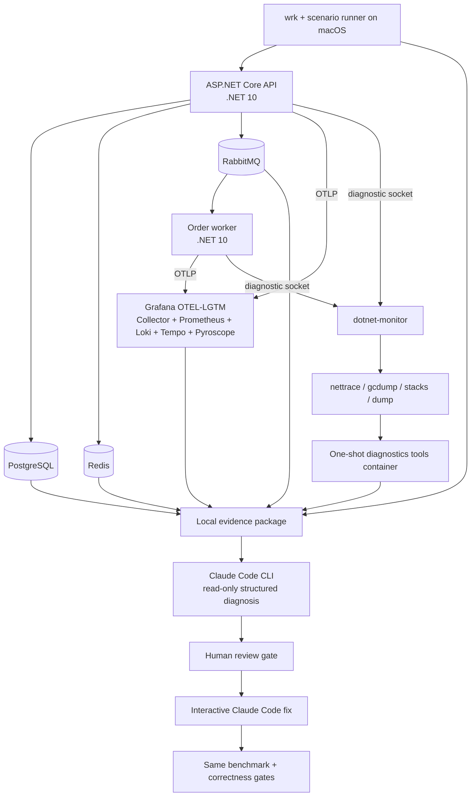

# .NET Performance Engineering + AI PoC

This repository is a local-only performance-engineering lab for .NET 10. It runs a synthetic commerce API and order worker against PostgreSQL, Redis, and RabbitMQ, exports OpenTelemetry logs/metrics/traces to Grafana OTEL-LGTM, exposes runtime diagnostics through a `dotnet-monitor` sidecar, packages evidence on the host filesystem, and gives Claude Code a controlled evidence-first diagnosis/fix workflow.

No Azure, S3, Blob Storage, or other cloud service is used.

## Architecture



## Components and local ports

| Component | Purpose | Host address |
|---|---|---|
| API | Workload endpoints | `http://127.0.0.1:8080` |
| Grafana | Dashboard, Explore, trace/log correlation | `http://127.0.0.1:3000` (`admin` / `admin`) |
| Prometheus | Metrics query API | `http://127.0.0.1:9090` |
| Loki | Log query API | `http://127.0.0.1:3100` |
| Tempo | Trace query API and optional MCP | `http://127.0.0.1:3200` |
| Pyroscope | Profiles backend | `http://127.0.0.1:4040` |
| dotnet-monitor | Diagnostic API | `http://127.0.0.1:52323` |
| PostgreSQL | Lab database | `127.0.0.1:5432` |
| Redis | Lab cache | `127.0.0.1:6379` |
| RabbitMQ management | Queue inspection | `http://127.0.0.1:15672` (`perflab` / `perflab`) |
| RabbitMQ Prometheus | Broker metrics | `http://127.0.0.1:15692/metrics` |

All published ports are bound to loopback. OTEL-LGTM persists its data in the `lgtm-data` Docker volume; evidence intended for AI is copied to `artifacts/runs`.

## Prerequisites

- Docker Desktop with Compose
- .NET SDK 10.0.101 or a later 10.0 patch
- `wrk`, `jq`, `curl`, and Git
- Claude Code CLI authenticated with your Anthropic account or configured provider
- `uvx` only if the generated Grafana MCP configuration uses the client-side `mcp-grafana` server

## Build without containers

```bash
dotnet restore PerfLab.slnx
dotnet build PerfLab.slnx --configuration Release --no-restore
```

## Quick start

Start a healthy control stack:

```bash
cp .env.example .env
docker compose up -d --build
curl http://127.0.0.1:8080/health/ready
```

Open Grafana and choose the provisioned **.NET Performance Engineering Lab** dashboard. Use Explore for detailed Tempo traces and Loki logs.

Run one controlled scenario under a suite run ID:

```bash
./scripts/run-single.sh S01 30
```

The command performs a deterministic dependency reset, recreates API/worker containers with the selected `PERF_SCENARIO` and unique telemetry correlation key, warms up for 10 seconds, runs `wrk`, and captures telemetry/dependency snapshots. It prints the suite evidence directory, for example:

```text
artifacts/runs/suite-20260822T120000Z/scenarios/S01
```

Use the lower-level `./scripts/run-scenario.sh S01 30` only when a flat, non-suite evidence package is specifically required. The control is `S00`. Scenario workload definitions are in `scenarios/scenarios.json`; they deliberately use neutral names so the identifier itself is not a diagnosis.

## Single, multiple, and all-scenario scripts

The convenience scripts all use the same suite format and accept an optional duration. Runtime capture remains a separate workload so its overhead never contaminates the reported measurement:

| Scope | Measurement only | Measurement plus runtime evidence |
|---|---|---|
| Single | `./scripts/run-single.sh S07 30` | `./scripts/run-single.sh S07 30 --with-runtime` |
| Multiple | `./scripts/run-multiple.sh S07,S12,S17 30` | `./scripts/run-multiple.sh S07,S12,S17 30 --with-runtime` |
| All | `./scripts/run-all.sh 30` | `./scripts/run-all.sh 30 --with-runtime --continue-on-error` |

`run-scenarios.sh` remains the underlying general-purpose runner, so these are equivalent:

```bash
./scripts/run-single.sh S21 30
./scripts/run-scenarios.sh S21 30

./scripts/run-multiple.sh S21,S22,S23,S24 30
./scripts/run-scenarios.sh S21,S22,S23,S24 30

./scripts/run-all.sh 30
./scripts/run-scenarios.sh all 30
```

An all-scenario run currently executes 27 measurements (`S00` through `S26`). With 30-second measurement and diagnostic phases it includes at least 27 minutes of workload time, plus warm-ups, dependency resets, container recreation, OTLP flushes, and artifact normalization.

## Multi-scenario suite runs

Use the suite runner directly when several scenarios must belong to one top-level run ID. Pass a comma-separated list, or `all` for the complete catalog:

```bash
./scripts/run-scenarios.sh S01,S07,S12 30
./scripts/run-scenarios.sh all 30
```

The scenarios execute sequentially so dependency resets, Docker resource contention, and process-local state cannot contaminate one another. The suite has one user-facing run ID, while each scenario receives a unique `telemetryRunId` for unambiguous trace and log correlation.

Add each scenario's recommended runtime capture and normalization with `--with-runtime`:

```bash
./scripts/run-scenarios.sh S01,S07,S12 30 --with-runtime
```

Catalog entries that request managed stacks automatically use a CPU-trace fallback in this Docker Desktop topology. The requested and effective diagnostics are recorded in each child's `runtime/capture.json`. Set `PERFLAB_ENABLE_DOTNET_MONITOR_STACKS=true` only when intentionally retesting dotnet-monitor's in-process `/stacks` endpoint.

By default the suite stops on the first failure and preserves all partial evidence. Use `--continue-on-error` when a full sweep should attempt every selected scenario; the final suite status is `completed-with-errors` and the command still exits nonzero if any scenario failed:

```bash
./scripts/run-scenarios.sh all 30 --with-runtime --continue-on-error
```

The resulting package is grouped under one run directory:

```text
artifacts/runs/suite-20260822T120000Z/
├── manifest.json                 # suite status and scenario index
├── facts.json                    # aggregate benchmark facts
└── scenarios/
    ├── S01/                      # complete single-scenario evidence package
    │   ├── manifest.json
    │   ├── facts.json
    │   ├── benchmark/
    │   ├── telemetry/
    │   ├── dependencies/
    │   ├── runtime/
    │   └── analysis/
    ├── S07/
    └── S12/
```

Run Claude against an individual child directory when diagnosing an isolated fault, for example `artifacts/runs/<suite-run-id>/scenarios/S07`. This preserves the one-fault-at-a-time reasoning model while keeping the complete experiment under one suite ID.

## Runtime diagnostics

Performance measurement and runtime capture are separate runs. Diagnostic tools perturb the target process, and `gcdump` triggers a full collection.

Use the capture recommended by the scenario catalog:

```bash
./scripts/capture-runtime.sh artifacts/runs/<run-id>
```

If the recommendation is `stacks`, the default local behavior records `trace` instead and documents the fallback in `runtime/capture.json`. This avoids treating the known dotnet-monitor sidecar profiler-channel HTTP 500 as a failed application scenario.

Or choose one explicitly:

```bash
./scripts/capture-runtime.sh artifacts/runs/<run-id> trace 30
./scripts/capture-runtime.sh artifacts/runs/<run-id> gcdump 30
./scripts/capture-runtime.sh artifacts/runs/<run-id> stacks 30
./scripts/capture-runtime.sh artifacts/runs/<run-id> dump 30
```

The script recreates API and worker containers in `diagnose` mode before applying load, which clears process-local leaks and exhausted pools left by the measurement run. It resolves the correct process by runtime UID rather than assuming a container PID.

Normalize binary artifacts before AI analysis:

```bash
./scripts/normalize-runtime.sh artifacts/runs/<run-id>
```

The one-shot diagnostics image contains `dotnet-trace`, `dotnet-gcdump`, `dotnet-dump`, and `dotnet-counters`. It converts `.nettrace` to Speedscope JSON and emits text reports for GC/process dumps. Dump analysis stays in a Linux ARM64 container matching the application architecture when Docker Desktop runs on Apple Silicon.

## Evidence package

Each run is self-contained:

```text
artifacts/runs/<run-id>/
├── manifest.json
├── facts.json
├── benchmark/
│   ├── warmup.txt
│   ├── wrk.txt
│   └── diagnostic-wrk.txt
├── telemetry/
│   ├── metrics/
│   │   └── application_metrics.json
│   ├── traces/
│   └── logs/
├── dependencies/
│   ├── postgres-statements.csv
│   ├── postgres-connections.csv
│   ├── postgres-order-plan.json
│   ├── redis-info.txt
│   ├── redis-slowlog.txt
│   ├── rabbitmq-queues.json
│   ├── rabbitmq-connections.json
│   ├── rabbitmq-channels.json
│   └── api-net-tcp.txt
├── runtime/
│   ├── capture.json
│   ├── processes*.json
│   └── api|worker/
├── source/
└── analysis/
```

`facts.json` contains observations, units, timestamps, and raw-source paths—not conclusions. Binary dumps remain local; Claude normally sees normalized summaries instead of consuming a huge opaque dump.

## How Claude Code is used

Yes, the PoC prompts Claude Code directly through its CLI, but it does not rely on a person pasting dashboard screenshots or raw dumps into a chat.

For the normal interactive, human-in-the-loop workflow, print the reusable prompt and then start the already authenticated Claude CLI without `-p`:

```bash
PERF_LAB_EVIDENCE_DIR="$(ls -td artifacts/runs/suite-* | head -1)"

./scripts/print-ai-prompt.sh "${PERF_LAB_EVIDENCE_DIR}"
claude
```

Copy the printed prompt into Claude. It works for a single package, a suite root, or one suite child. The source template is `ai/interactive-diagnosis-prompt.md`; it requires evidence-first reasoning, exact source locations, competing hypotheses, a minimal fix, and an unchanged-workload validation plan. For suite runs it also asks Claude to use `S00` as a general process baseline and produce a cross-scenario comparison.

The optional structured diagnosis phase is non-interactive and read-only. Run it against a flat single-scenario package or a suite child, not a suite root:

```bash
./scripts/analyze-with-claude.sh artifacts/runs/<run-id>
```

The script effectively runs:

```bash
claude -p \
  --permission-mode dontAsk \
  --allowedTools "Read,Grep,Glob" \
  --no-session-persistence \
  --output-format json \
  --json-schema '<diagnosis schema>' \
  '<evidence-first prompt and evidence path>'
```

Claude can read the evidence package and relevant source, but it cannot edit or invoke shell commands in this phase. The schema requires measured symptoms, ranked hypotheses, causal chain, exact source lines, a minimal fix, risks, validation gates, and limitations. The raw CLI envelope is retained as `analysis/claude-raw.json`; the normalized report is `analysis/diagnosis.json`.

Set an optional model or spend ceiling before running:

```bash
export CLAUDE_MODEL=sonnet
export CLAUDE_MAX_BUDGET_USD=5
```

After a human reviews the diagnosis, start the separate edit phase:

```bash
./scripts/claude-fix.sh artifacts/runs/<run-id>
```

This opens an interactive Claude Code session with edit acceptance enabled. Claude reads the approved diagnosis, changes the smallest relevant source surface, builds the solution, and explains risks. It is intentionally not a fully unattended auto-fix pipeline.

### Optional live Grafana MCP access

The primary AI input is the immutable evidence package. MCP is optional for follow-up questions and live telemetry exploration.

OTEL-LGTM generates an MCP configuration for Grafana/Tempo. Export it after the stack is running:

```bash
./scripts/configure-claude-mcp.sh
```

This saves the container-generated configuration as the ignored local file `ai/generated-mcp.json`. The diagnosis script detects it and passes `--mcp-config` to Claude. Tempo MCP is enabled in `compose.yaml`; Grafana MCP can query metrics, logs, dashboards, and data sources. Do not replace the captured evidence with unconstrained live queries—live state can change during analysis and is harder to audit.

## Controlled scenario coverage

The implementation includes one healthy control and 26 deliberately problematic behaviors. The table states the lab's expected mechanism for maintainers and presenters; an AI diagnosis must still prove it from captured measurements and source rather than treating this table as evidence.

| ID | Area | Workload | Deliberately injected mechanism | Expected evidence | Runtime capture |
|---|---|---|---|---|---|
| S00 | Control | Catalog recommendations, 64 connections | Bounded query and linear in-memory ordering | Healthy latency/throughput baseline; bounded DB spans and allocations | CPU trace |
| S01 | CPU | Catalog recommendations, 64 | 2,500 candidates ranked with nested comparisons and repeated span equality | API CPU saturation, hot ranking loop, higher latency, lower throughput | CPU trace |
| S02 | Threading | Runtime threading, 128 | Synchronous wait on `Task.Delay` inside request processing | Blocked worker threads, ThreadPool growth/queueing, long tail latency | Managed stacks → trace fallback |
| S03 | Synchronization | Runtime threading, 96 | Process-wide semaphore held across a DB call and delay | Serialized requests, low CPU with growing wait time and long tails | Managed stacks → trace fallback |
| S04 | Memory retention | Runtime memory, 32 | Static event subscribers retain capped 64 KiB arrays | Live heap grows toward the safety cap and survives collections | GC dump before/after |
| S05 | Allocation/GC | Runtime memory, 32 | Repeated 128 KiB buffers, Base64 strings, JSON copies, and deserialization | LOH allocation churn, GC pressure, CPU in encoding/serialization | CPU trace |
| S06 | Scheduling | Runtime threading, 64 | 128 `Task.Run` operations and buffers per request | Excess work items, scheduling overhead, allocation and CPU pressure | CPU trace |
| S07 | PostgreSQL queries | Customer orders, 48 | One order query followed by one item query per order | N+1 spans/statements, amplified DB calls and request latency | Managed stacks → trace fallback |
| S08 | PostgreSQL pagination | Deep order-history page, 48 | Large `OFFSET` pagination at page 100 | Rows scanned/discarded, slower DB span and unfavorable plan | Managed stacks → trace fallback |
| S09 | PostgreSQL lifecycle | Customer orders, 64 | Open Npgsql connections retained in a static collection | Default pool drains, acquisition waits/timeouts, retained DB sockets | Managed stacks → trace fallback |
| S10 | PostgreSQL locking | Order creation, 64 | Hot row transaction remains open across Redis work, delay, and publication | Lock waits, serialized updates, slow/erroring POST requests | Managed stacks → trace fallback |
| S11 | EF Core materialization | Customer orders, 32 | Entire tracked order/item graph loaded before in-memory paging | Excess rows, allocations, tracking overhead, larger GC dump | GC dump |
| S12 | Cache coordination | Catalog cache, 128 | Cache miss refreshes are not coalesced and include delayed DB work | Cache stampede, duplicated DB queries, latency spike after reset/expiry | Managed stacks → trace fallback |
| S13 | Redis command pattern | Catalog cache, 64 | 100 cache fragments fetched sequentially | Many serialized Redis operations per request and high dependency time | Managed stacks → trace fallback |
| S14 | Redis sockets | Catalog cache, 64 | `ConnectionMultiplexer` created and disposed per request | Redis connection churn, socket growth/TIME_WAIT, connect overhead | CPU trace |
| S15 | Redis key lifecycle | Catalog cache, 64 | Unique GUID key per request with no expiry | Keyspace and Redis memory growth with almost no hits | GC dump |
| S16 | RabbitMQ sockets | Order creation, 64 | RabbitMQ connection and channel created for every publish | Broker connection/channel churn, TCP overhead, lower throughput | CPU trace |
| S17 | Consumer backpressure | Order creation, worker target, 48 | One consumer dispatch slot, prefetch 500, and blocking 100 ms processing | Queue backlog, unacked messages, slow drain and blocked worker | Managed stacks → trace fallback |
| S18 | Retry behavior | Poison order creation, worker target, 8 | Immediate requeue up to a capped 50 attempts | Retry/log storm, repeated deliveries, dead-letter activity | Managed stacks → trace fallback |
| S19 | RabbitMQ channel ownership | Order creation, 128 | Concurrent publishers use one shared channel without serialization | Channel contention/protocol risk, publish failures or irregular latency | CPU trace |
| S20 | Message memory ownership | Order creation, worker target, 48 | Broker-owned delivery memory retained without copying | Retained/invalid payload ownership and worker heap growth | GC dump |
| S21 | PostgreSQL pool—low | Pool endpoint, 48 | Npgsql pool capped at 2 while each request holds its lease for deterministic work | High acquisition wait, pool timeouts/non-2xx responses, only two active pool connections | CPU trace + pool metrics |
| S22 | PostgreSQL pool—high | Pool endpoint, 96 | Npgsql pool permits 64 concurrent leases for the same workload | Large PostgreSQL backend/socket footprint; oversizing masks long lease duration and shifts pressure downstream | CPU trace + pool metrics |
| S23 | Redis pseudo-pool—low | Pool endpoint, 64 | One exclusively leased `ConnectionMultiplexer` despite its thread-safe multiplexed design | Client-side lease queue, low throughput, high custom pool-wait metric | CPU trace + pool metrics |
| S24 | Redis pseudo-pool—high | Pool endpoint, 128 | 32 application-managed multiplexers and exclusive slots | Redis `connected_clients`/socket inflation and unnecessary client memory/threads | CPU trace + pool metrics |
| S25 | HTTP pool—low | Internal upstream call, 64 | Singleton handler limited to two connections against a 100 ms dependency | `http.client.request.time_in_queue`, long tails, about two active upstream connections | CPU trace + HTTP metrics |
| S26 | HTTP pool—high | Internal upstream call, 128 | Singleton handler permits 128 pooled connections to the same dependency | High open/idle TCP connection count and resource footprint | CPU trace + HTTP metrics |

### What “Redis pool” means here

StackExchange.Redis does not expose a conventional fixed-size connection pool: `ConnectionMultiplexer` is thread-safe, multiplexes concurrent commands, and is designed to be shared and reused. S23/S24 deliberately wrap multiplexers in an application-owned exclusive pool to demonstrate the two common mistakes—serializing work through too few slots and creating many multiplexers to compensate. The production correction is normally one appropriately configured, long-lived multiplexer, not a larger custom pool. See the [StackExchange.Redis basic usage guidance](https://stackexchange.github.io/StackExchange.Redis/Basics.html).

Npgsql connections are pooled by default; its minimum/maximum settings define retention and capacity, and closing a logical connection returns the physical connection to the pool. See the [Npgsql connection-string parameters](https://www.npgsql.org/doc/connection-string-parameters) and [basic usage guidance](https://www.npgsql.org/doc/basic-usage.html). `HttpClient` pools belong to `SocketsHttpHandler`; connection limits that are too low queue callers, while unbounded/high fan-out or poor handler lifetime can create excessive sockets. See the [.NET HttpClient guidelines](https://learn.microsoft.com/dotnet/fundamentals/networking/http/httpclient-guidelines).

### Existing socket and pool-adjacent scenarios

Yes, socket issues were already represented before S21–S26:

- S09 retains Npgsql connections, which consumes both pool leases and PostgreSQL TCP sockets until the pool exhausts.
- S14 creates a Redis multiplexer per request, producing Redis client/socket churn.
- S16 creates a RabbitMQ connection per publish, producing broker connection/channel and TCP churn.
- S19 is primarily unsafe shared-channel concurrency rather than socket exhaustion.
- S02/S06 cover ThreadPool starvation/fan-out; the .NET ThreadPool is not a network connection pool.

S21–S26 add explicit low/high capacity experiments for Npgsql, an intentionally application-managed Redis pseudo-pool, and `SocketsHttpHandler`. Other useful future extensions would be RabbitMQ channel-pool sizing, outbound gRPC HTTP/2 stream limits, and multi-tenant per-destination pool fragmentation.

The low/high pairs are deliberately two unsafe extremes, not a before/after fix pair. Compare S21 with S22, S23 with S24, and S25 with S26 to expose the queueing-versus-resource trade-off; use the validation plan to test a separately chosen right-sized configuration. S00 remains useful for process-level health but is not an endpoint-matched baseline for the pool workloads.

Only one scenario is selected per process startup. A comma-separated or `all` suite still runs scenarios sequentially in fresh API/worker containers; it does not activate several injected behaviors simultaneously.

## Validation protocol

For a defensible before/after comparison:

1. Keep the same source revision except for the proposed fix.
2. Use the same seed scale, scenario, endpoint, request body, thread count, connection count, duration, and Docker Desktop resources.
3. Reset Redis, RabbitMQ queues, and `pg_stat_statements` before each measurement.
4. Warm up, then run at least five 60-second measurement repetitions for a presentation-quality result.
5. Keep diagnostic captures separate from reported throughput/latency.
6. Check response correctness and error count before comparing speed.
7. Require a mechanism-specific gate: hotspot disappears, thread-pool queue remains bounded, live heap plateaus, DB spans collapse, plan uses the intended access path, pool timeouts disappear, cache refreshes coalesce, or RabbitMQ backlog drains.

Docker Desktop measurements are comparative numbers for this machine, not production capacity claims.

## Safety limits

- API: 1 CPU, 768 MiB
- Worker: 0.75 CPU, 512 MiB
- Normal PostgreSQL pool: 20 connections, 5-second connect/command timeout
- Pool experiments: 2 connections for S21 and 64 for S22, below PostgreSQL's local server limit
- Redis pseudo-pool experiments: 1 multiplexer for S23 and a capped 32 for S24
- HTTP pool experiments: 2 connections for S25 and a capped 128 loopback connections for S26
- Redis: 256 MiB with `allkeys-lru`
- RabbitMQ work queue: maximum 10,000 messages
- Poison-message requeue: local cap of 50 before dead-lettering
- Retained-memory scenario: approximately 125 MiB cap
- All datasets are synthetic and all service ports are loopback-only

Stop the stack while preserving volumes:

```bash
docker compose down
```

`docker compose down -v` also deletes all PoC database/cache/broker/telemetry volumes; use it only when you intentionally want a full data reset.
