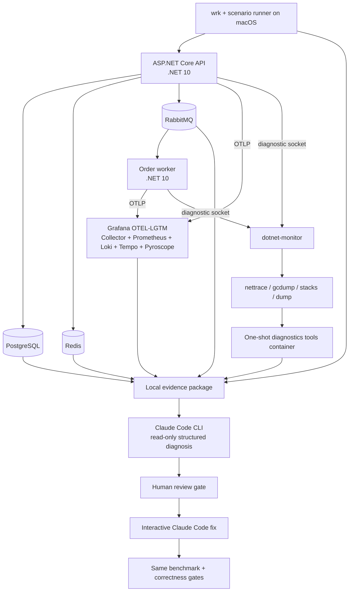

# .NET Performance Engineering + AI PoC

This repository is a local-only performance-engineering lab for .NET 10. It runs a synthetic commerce API and order worker against PostgreSQL, Redis, and RabbitMQ, exports OpenTelemetry logs/metrics/traces to Grafana OTEL-LGTM, exposes runtime diagnostics through a `dotnet-monitor` sidecar, packages evidence on the host filesystem, and gives Claude Code a controlled evidence-first diagnosis/fix workflow.

No Azure, S3, Blob Storage, or other cloud service is used.

## Architecture



## Components and local ports

| Component | Purpose | Host address |
|---|---|---|
| API | Workload endpoints | `http://127.0.0.1:8080` |
| Grafana | Dashboard, Explore, trace/log correlation | `http://127.0.0.1:3000` (`admin` / `admin`) |
| Prometheus | Metrics query API | `http://127.0.0.1:9090` |
| Loki | Log query API | `http://127.0.0.1:3100` |
| Tempo | Trace query API and optional MCP | `http://127.0.0.1:3200` |
| Pyroscope | Profiles backend | `http://127.0.0.1:4040` |
| dotnet-monitor | Diagnostic API | `http://127.0.0.1:52323` |
| PostgreSQL | Lab database | `127.0.0.1:5432` |
| Redis | Lab cache | `127.0.0.1:6379` |
| RabbitMQ management | Queue inspection | `http://127.0.0.1:15672` (`perflab` / `perflab`) |
| RabbitMQ Prometheus | Broker metrics | `http://127.0.0.1:15692/metrics` |

All published ports are bound to loopback. OTEL-LGTM persists its data in the `lgtm-data` Docker volume; evidence intended for AI is copied to `artifacts/runs`.

## Prerequisites

- Docker Desktop with Compose
- .NET SDK 10.0.101 or a later 10.0 patch
- `wrk`, `jq`, `curl`, and Git
- Claude Code CLI authenticated with your Anthropic account or configured provider
- `uvx` only if the generated Grafana MCP configuration uses the client-side `mcp-grafana` server

## Build without containers

```bash
dotnet restore PerfLab.slnx
dotnet build PerfLab.slnx --configuration Release --no-restore
```

## Quick start

Start a healthy control stack:

```bash
cp .env.example .env
docker compose up -d --build
curl http://127.0.0.1:8080/health/ready
```

Open Grafana and choose the provisioned **.NET Performance Engineering Lab** dashboard. Use Explore for detailed Tempo traces and Loki logs.

Run a complete measurement for one controlled scenario:

```bash
./scripts/run-scenario.sh S01 30
```

The command performs a deterministic dependency reset, recreates API/worker containers with the selected `PERF_SCENARIO` and unique `PERF_RUN_ID`, warms up for 10 seconds, runs `wrk`, and captures telemetry/dependency snapshots. It prints the evidence directory, for example:

```text
artifacts/runs/s01-20260822T120000Z
```

The control is `S00`. Scenario workload definitions are in `scenarios/scenarios.json`; they deliberately use neutral names so the identifier itself is not a diagnosis.

## Multi-scenario suite runs

Use the suite runner when several scenarios must belong to one top-level run ID. Pass a comma-separated list, or `all` for the complete catalog:

```bash
./scripts/run-scenarios.sh S01,S07,S12 30
./scripts/run-scenarios.sh all 30
```

The scenarios execute sequentially so dependency resets, Docker resource contention, and process-local state cannot contaminate one another. The suite has one user-facing run ID, while each scenario receives a unique `telemetryRunId` for unambiguous trace and log correlation.

Add each scenario's recommended runtime capture and normalization with `--with-runtime`:

```bash
./scripts/run-scenarios.sh S01,S07,S12 30 --with-runtime
```

By default the suite stops on the first failure and preserves all partial evidence. Use `--continue-on-error` when a full sweep should attempt every selected scenario; the final suite status is `completed-with-errors` and the command still exits nonzero if any scenario failed:

```bash
./scripts/run-scenarios.sh all 30 --with-runtime --continue-on-error
```

The resulting package is grouped under one run directory:

```text
artifacts/runs/suite-20260822T120000Z/
├── manifest.json                 # suite status and scenario index
├── facts.json                    # aggregate benchmark facts
└── scenarios/
    ├── S01/                      # complete single-scenario evidence package
    │   ├── manifest.json
    │   ├── facts.json
    │   ├── benchmark/
    │   ├── telemetry/
    │   ├── dependencies/
    │   ├── runtime/
    │   └── analysis/
    ├── S07/
    └── S12/
```

Run Claude against an individual child directory when diagnosing an isolated fault, for example `artifacts/runs/<suite-run-id>/scenarios/S07`. This preserves the one-fault-at-a-time reasoning model while keeping the complete experiment under one suite ID.

## Runtime diagnostics

Performance measurement and runtime capture are separate runs. Diagnostic tools perturb the target process, and `gcdump` triggers a full collection.

Use the capture recommended by the scenario catalog:

```bash
./scripts/capture-runtime.sh artifacts/runs/<run-id>
```

Or choose one explicitly:

```bash
./scripts/capture-runtime.sh artifacts/runs/<run-id> trace 30
./scripts/capture-runtime.sh artifacts/runs/<run-id> gcdump 30
./scripts/capture-runtime.sh artifacts/runs/<run-id> stacks 30
./scripts/capture-runtime.sh artifacts/runs/<run-id> dump 30
```

The script recreates API and worker containers in `diagnose` mode before applying load, which clears process-local leaks and exhausted pools left by the measurement run. It resolves the correct process by runtime UID rather than assuming a container PID.

Normalize binary artifacts before AI analysis:

```bash
./scripts/normalize-runtime.sh artifacts/runs/<run-id>
```

The one-shot diagnostics image contains `dotnet-trace`, `dotnet-gcdump`, `dotnet-dump`, and `dotnet-counters`. It converts `.nettrace` to Speedscope JSON and emits text reports for GC/process dumps. Dump analysis stays in a Linux ARM64 container matching the application architecture when Docker Desktop runs on Apple Silicon.

## Evidence package

Each run is self-contained:

```text
artifacts/runs/<run-id>/
├── manifest.json
├── facts.json
├── benchmark/
│   ├── warmup.txt
│   ├── wrk.txt
│   └── diagnostic-wrk.txt
├── telemetry/
│   ├── metrics/
│   ├── traces/
│   └── logs/
├── dependencies/
│   ├── postgres-statements.csv
│   ├── postgres-order-plan.json
│   ├── redis-info.txt
│   ├── redis-slowlog.txt
│   └── rabbitmq-queues.json
├── runtime/
│   ├── processes*.json
│   └── api|worker/
├── source/
└── analysis/
```

`facts.json` contains observations, units, timestamps, and raw-source paths—not conclusions. Binary dumps remain local; Claude normally sees normalized summaries instead of consuming a huge opaque dump.

## How Claude Code is used

Yes, the PoC prompts Claude Code directly through its CLI, but it does not rely on a person pasting dashboard screenshots or raw dumps into a chat.

The diagnosis phase is non-interactive and read-only:

```bash
./scripts/analyze-with-claude.sh artifacts/runs/<run-id>
```

The script effectively runs:

```bash
claude -p \
  --permission-mode dontAsk \
  --allowedTools "Read,Grep,Glob" \
  --no-session-persistence \
  --output-format json \
  --json-schema '<diagnosis schema>' \
  '<evidence-first prompt and evidence path>'
```

Claude can read the evidence package and relevant source, but it cannot edit or invoke shell commands in this phase. The schema requires measured symptoms, ranked hypotheses, causal chain, exact source lines, a minimal fix, risks, validation gates, and limitations. The raw CLI envelope is retained as `analysis/claude-raw.json`; the normalized report is `analysis/diagnosis.json`.

Set an optional model or spend ceiling before running:

```bash
export CLAUDE_MODEL=sonnet
export CLAUDE_MAX_BUDGET_USD=5
```

After a human reviews the diagnosis, start the separate edit phase:

```bash
./scripts/claude-fix.sh artifacts/runs/<run-id>
```

This opens an interactive Claude Code session with edit acceptance enabled. Claude reads the approved diagnosis, changes the smallest relevant source surface, builds the solution, and explains risks. It is intentionally not a fully unattended auto-fix pipeline.

### Optional live Grafana MCP access

The primary AI input is the immutable evidence package. MCP is optional for follow-up questions and live telemetry exploration.

OTEL-LGTM generates an MCP configuration for Grafana/Tempo. Export it after the stack is running:

```bash
./scripts/configure-claude-mcp.sh
```

This saves the container-generated configuration as the ignored local file `ai/generated-mcp.json`. The diagnosis script detects it and passes `--mcp-config` to Claude. Tempo MCP is enabled in `compose.yaml`; Grafana MCP can query metrics, logs, dashboards, and data sources. Do not replace the captured evidence with unconstrained live queries—live state can change during analysis and is harder to audit.

## Controlled scenario coverage

The current implementation includes one control plus twenty selectable behaviors covering:

- CPU complexity and excessive scheduling
- blocking waits, broad synchronization, and thread-pool pressure
- retained object graphs and large-object allocation churn
- N+1 access, inefficient deep pagination, connection lifecycle, lock duration, and over-materialization
- cache stampede, sequential Redis calls, connection churn, and keyspace growth
- RabbitMQ connection/channel lifecycle, consumer backpressure, poison-message retries, concurrent publishing, and payload ownership

Only one scenario is selected at startup. Do not activate multiple scenarios in the first diagnosis; combined incidents are useful only after individual mechanisms have been demonstrated.

## Validation protocol

For a defensible before/after comparison:

1. Keep the same source revision except for the proposed fix.
2. Use the same seed scale, scenario, endpoint, request body, thread count, connection count, duration, and Docker Desktop resources.
3. Reset Redis, RabbitMQ queues, and `pg_stat_statements` before each measurement.
4. Warm up, then run at least five 60-second measurement repetitions for a presentation-quality result.
5. Keep diagnostic captures separate from reported throughput/latency.
6. Check response correctness and error count before comparing speed.
7. Require a mechanism-specific gate: hotspot disappears, thread-pool queue remains bounded, live heap plateaus, DB spans collapse, plan uses the intended access path, pool timeouts disappear, cache refreshes coalesce, or RabbitMQ backlog drains.

Docker Desktop measurements are comparative numbers for this machine, not production capacity claims.

## Safety limits

- API: 1 CPU, 768 MiB
- Worker: 0.75 CPU, 512 MiB
- PostgreSQL pool: 20 connections, 5-second connect/command timeout
- Redis: 256 MiB with `allkeys-lru`
- RabbitMQ work queue: maximum 10,000 messages
- Poison-message requeue: local cap of 50 before dead-lettering
- Retained-memory scenario: approximately 125 MiB cap
- All datasets are synthetic and all service ports are loopback-only

Stop the stack while preserving volumes:

```bash
docker compose down
```

`docker compose down -v` also deletes all PoC database/cache/broker/telemetry volumes; use it only when you intentionally want a full data reset.
