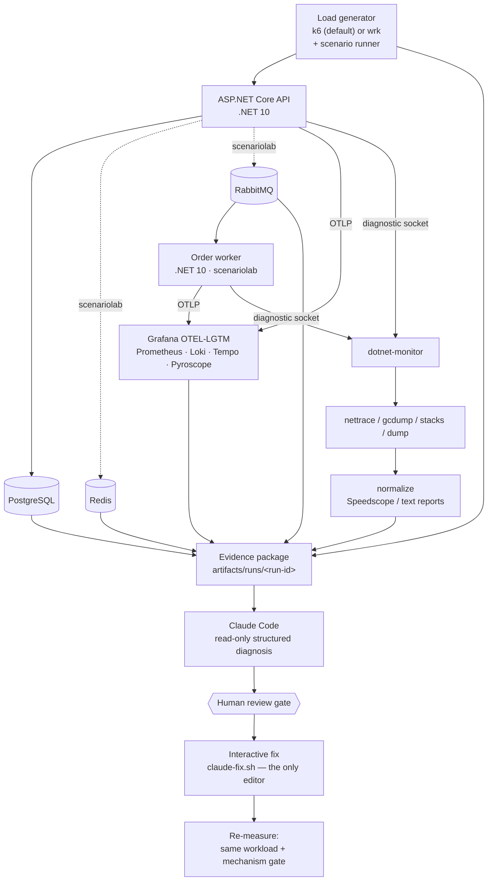

# Reusable performance-engineering lab

A local, language-neutral **performance-evidence harness** built as a thin
ports-and-adapters toolkit. A stable core drives measurement, evidence capture,
normalization, and a read-only AI diagnosis; everything project- or
language-specific plugs in through a bash descriptor and small adapter scripts.

The reference project is a .NET 10 service (plus an order worker) with
**deliberately planted performance defects** — a synthetic commerce API measured
against PostgreSQL, Redis, and RabbitMQ, exporting OpenTelemetry
logs/metrics/traces to Grafana OTEL-LGTM and runtime diagnostics through a
`dotnet-monitor` sidecar. Nothing runs in the cloud; every port is loopback-only.

Onboarding another project or runtime means **adding files, not editing the
core**.

> Architecture, contracts, and the per-runtime adapter matrix live in
> [`BLUEPRINT.md`](BLUEPRINT.md).

## Architecture

The load generator drives the app; telemetry, dependency state, and runtime
diagnostics all fold into one immutable evidence package on the host, which is
the only thing the AI phase reads.



`scenariolab` uses the full dependency set (postgres + redis + rabbitmq + worker);
`ecommerce` is a single API over postgres only. The two labs publish the **same**
loopback ports, so only one runs at a time — the harness stops the other lab's
stack automatically on bring-up.

**Single-operator by design:** because the labs share one set of host ports and a
single Compose project per lab, running **two harness invocations at once is
unsupported** — a second run recreates the app containers under a different
scenario mid-measurement and corrupts both. Run one scenario/suite/sweep at a
time (the pe-test runners already drive their scenarios sequentially).

## Repository layout

```
harness/                          # reusable toolkit (never edited per project)
├── core/
│   ├── run/                     # run-single/multiple/all wrappers + run-scenario(s) orchestrators
│   ├── pe-tests/                # perf-engineering runners: run-sweep/mix/repeat/data-scale/fault
│   ├── capture/                 # capture-evidence + capture/normalize-runtime (the evidence pipeline)
│   ├── analyze/                 # trends/leak, A/B regression, gate (+steady), capacity knee, steady-state, USE bottleneck, CPU + heap diff, cross-commit trend
│   └── lib/                     # common.sh (shared helpers) + lab-context.sh (lab-specific init)
├── adapters/
│   ├── runtime/dotnet/           # metrics.sh, capture.sh, normalize.sh, versions.sh, evidence-extra.sh, diagnostics/Dockerfile
│   ├── dependency/{postgres,redis,rabbitmq}/  # reset/sample-midload/snapshot.sh (generic; config-parameterized)
│   ├── loadgen/{wrk,k6}/         # run.sh (shared contract) + default.lua / default.js (fallback workload)
│   └── observability/grafana/    # generate-dashboards.py — emits the per-lab Grafana dashboard suite
└── ai/                           # diagnosis.schema.json, *-prompt.md, scripts/
labs/scenariolab/                 # the EXPERIMENT (per project): what to test + how to run it
├── lab.config.sh                 # descriptor — the single re-pointing seam (bash)
├── scenarios.tsv                 # this project's API scenarios
├── loadgen/{k6.js,wrk.lua}       # this lab's workload (auth/data live here; else the shared default)
├── dependencies/<dep>/<phase>.sh # project-specific probes (e.g. postgres EXPLAIN), by convention
├── infra/grafana/dashboards/     # provisioned dashboard suite (generated; one JSON per focused board)
├── infra/observability/          # otelcol-extra.yaml — additive collector overlay for dependency scrapes
└── compose.yaml  infra/          # lab wiring: app + deps + observability + diagnostics
source/dotnet/scenariolab/        # the APP under test ONLY (pristine — swappable for a real repo)
└── PerfLab.slnx  src/{Api,Worker,Shared}/
artifacts/runs/<run-id>/          # evidence packages
```

Three concerns, three homes: `harness/` (the reusable engine), `labs/<project>/`
(the experiment — descriptor, scenarios, lab compose/infra), and
`source/<runtime>/<project>/` (the application, kept clean). The harness
auto-discovers the sole lab; with several, select one via `PERFLAB_LAB=<name>`.

### Labs in this repo

| Lab | App | Dependencies | Demonstrates |
|---|---|---|---|
| `scenariolab` | `source/dotnet/scenariolab` (`PerfLab.Api` + worker) | postgres, redis, rabbitmq | the reference planted-defect catalog (`S00`–`S27`) |
| `ecommerce` | `source/dotnet/ecommerce` (`ECommerce.Api`) | postgres | a JWT-protected CRUD API (`E00`–`E14`); per-lab k6 workload that logs in via `setup()`, and postgres db/user `ecommerce` (parameterized dependency adapter) |
| `remote-example` | *already-deployed endpoint* (not owned here) | none | the **remote target mode** (`PERFLAB_TARGET=remote`): a black-box load/capacity test against a URL, no Compose/telemetry ownership (`R00`–`R02`) |

With more than one lab present, **every command needs a lab selected**, e.g.
`PERFLAB_LAB=ecommerce ./harness/core/run/run-multiple.sh E02,E03 20`.

## Target modes — local vs remote

A lab declares `PERFLAB_TARGET` (default `local`). It decides whether the harness
**owns** the app under test.

| | `local` (default) | `remote` |
|---|---|---|
| App lifecycle | harness runs `compose up/down`, rebuilds, waits for ready | app is **already deployed**; harness never touches lifecycle |
| Dependencies | reset/reseed/fault the owned postgres/redis/rabbitmq | none owned — dependencies are off-limits |
| Warm-up + measure window | yes | yes |
| Load generator SLIs → `facts.json` | yes | yes — **the entire evidence** |
| Telemetry (Prometheus/Tempo/Loki) | captured, **run-id-scoped** | off by default; opt-in `PERFLAB_REMOTE_TELEMETRY=1` reads it **window-scoped** |
| Runtime diagnostics (dotnet-monitor nettrace/gcdump/stacks) | available | off by default; opt-in `PERFLAB_REMOTE_DIAGNOSTICS=1` **+ ack** |
| `manifest.json` | `"target":"local"` | `"target":"remote"` (+ `"remoteTelemetry"`) |

**Remote** turns the harness into a black-box load/capacity tool against a URL:
it health-checks `PERFLAB_READY_URL`, warms up, measures against `PERFLAB_BASE_URL`,
and records the load generator's own throughput / latency-percentile / error-rate
SLIs. It is the mode for hitting a staging or production endpoint you do **not**
control.

```bash
# Point the example lab at your deployment (or edit labs/remote-example/lab.config.sh):
PERFLAB_LAB=remote-example \
PERFLAB_BASE_URL=https://staging.example.com \
PERFLAB_READY_URL=https://staging.example.com/health/ready \
  ./harness/core/run/run-scenario.sh R01 30
```

Works against a remote target: `run-scenario`, **`run-sweep`** (capacity knee),
`run-mix`, `run-repeat` (without `--reseed`), every load profile
(`steady`/`ramp`/`stress`/`spike`/`soak`/`capacity`/`arrival`), `compare-runs`,
`analyze-trends`. Refused (they mutate owned state, with a clear error):
`run-fault`, `run-data-scale`, `run-repeat --reseed`.

Caveats: k6 (a host process) is the recommended generator. **wrk runs in Docker**,
so a host-loopback `PERFLAB_BASE_URL` (`127.0.0.1`) is unreachable from inside the
container — use k6 for a host-local target; wrk is fine against a genuinely remote
host. For a protected endpoint, pass a pre-minted token per run via a **JSON**
`PERF_HEADERS='{"Authorization":"Bearer <token>"}'` (both workloads parse it as a
JSON object, not a raw header string; never commit tokens). Remote SLIs are measured
**from this machine**, so they include client-to-server network latency — keep the
generator close to the target and hold it constant across an A/B.

### Remote with more access: observed + diagnostics

`remote` is really a spectrum of how much of the deployed environment you can
reach. The plain mode assumes only a URL; two independent opt-ins add back
evidence when you have more:

**Remote-observed** (`PERFLAB_REMOTE_TELEMETRY=1`) — you have **read access** to
the deployed env's Prometheus/Tempo/Loki. The harness reads them too, but scoped by
the **measurement time window** instead of a run id (the deployed app was not
started by us, so it carries no `perf.run.id`). The catch: without run-id
isolation, everything else serving traffic in that window is swept in — trust it
only where your load dominates or the environment is isolated (a dedicated
staging). Requires the env's endpoint URLs and its own job/service label names:

```bash
PERFLAB_LAB=remote-example PERFLAB_REMOTE_TELEMETRY=1 \
PERFLAB_PROMETHEUS_URL=https://prom.staging PERFLAB_TEMPO_URL=https://tempo.staging \
PERFLAB_LOKI_URL=https://loki.staging \
PERFLAB_PROM_JOB_REGEX='staging-api-.*' PERFLAB_SERVICE_NAME_REGEX='checkout-api' \
  ./harness/core/run/run-scenario.sh R01 30
```

**Remote + diagnostics** (`PERFLAB_REMOTE_DIAGNOSTICS=1` **+ ack**) — the deployed
app exposes a reachable **dotnet-monitor** endpoint, so `capture-runtime` can pull
a nettrace/gcdump against it. Because attaching a profiler or pulling a gcdump/dump
**perturbs the live process** (a gcdump pauses the GC; a dump freezes it) and can
expose secrets/PII from process memory, it demands an explicit acknowledgement and
should be a **separate run from measurement**, on staging where possible:

```bash
PERFLAB_LAB=remote-example PERFLAB_REMOTE_DIAGNOSTICS=1 \
PERFLAB_REMOTE_DIAG_ACK=i-understand-perturbation \
PERFLAB_DIAGNOSTICS_URL=http://staging-host:18323 PERFLAB_DIAG_TARGETS='remote:MyApp.Api' \
  ./harness/core/capture/capture-runtime.sh artifacts/runs/<run-id> trace 20
```

Without the ack (or with `PERFLAB_REMOTE_DIAGNOSTICS` unset), `capture-runtime`
refuses on a remote target. Remote diagnostics are **standalone-only** — a suite
(`run-scenarios`) skips them (it should not auto-perturb a live target, and the raw
capture is normalized offline), so run `capture-runtime` directly for one scenario.
It reads the endpoint, readiness URL and workload from the **manifest** (not the
current catalog), so it can't profile the remote process while loading somewhere else.

Both tiers leave the app's **lifecycle and owned dependencies untouched** — but the
*load itself is real traffic*: a write scenario (POST/PUT/PATCH/DELETE) **mutates real
data** on the target. `run-scenario` warns on a non-GET method; a **diagnostic**
write is refused outright unless you also set `PERFLAB_REMOTE_WRITE_ACK=i-understand-data-mutation`.
Prefer read scenarios against production, or a disposable/staging dataset for writes.

More remote guardrails: a failed readiness check **fails closed** (refuses to load an
unhealthy target unless `PERFLAB_REMOTE_ALLOW_UNHEALTHY=1` — also the escape hatch when
the readiness URL itself requires auth this bare check can't supply, so point
`PERFLAB_READY_URL` at an **unauthenticated** health route where you can); a remote
tier will not inherit the localhost telemetry/diagnostics defaults (set the deployed
env's URLs explicitly); and re-capturing a package standalone must re-supply its
matching lab/env or `capture-evidence` hard-fails rather than query localhost. **Security:** dotnet-monitor is a powerful
endpoint (it can dump process memory); reach it over a **secured tunnel or
authenticating proxy** (e.g. `kubectl port-forward` to a local `PERFLAB_DIAGNOSTICS_URL`)
rather than exposing it, and never put credentials in a URL (they would be logged).

## Components and local ports

All ports bind to loopback (`127.0.0.1`) and all datasets are synthetic. Both
labs use the **same** host ports; `ecommerce` simply omits Redis and RabbitMQ.

| Component | Purpose | Host address | Lab |
|---|---|---|---|
| API | Workload endpoints | `http://127.0.0.1:8080` | both |
| Grafana | Dashboard suite, Explore, trace/log correlation | `http://127.0.0.1:3000` (`admin` / `admin`) | both |
| Prometheus | Metrics query API (OTLP + remote-write receivers on) | `http://127.0.0.1:9090` | both |
| Loki | Log query API | `http://127.0.0.1:3100` | both |
| Tempo | Trace query API | `http://127.0.0.1:3200` | both |
| Pyroscope | Profiles backend — reachable but empty (see note) | `http://127.0.0.1:4040` | both |
| OTLP ingest | Collector gRPC / HTTP | `127.0.0.1:4317` / `4318` | both |
| dotnet-monitor | Diagnostic API (trace/gcdump/stacks/dump) | `http://127.0.0.1:18323` | both |
| PostgreSQL | Lab database (`perflab` / `perflab`) | `127.0.0.1:5432` | both |
| postgres-exporter | Server-side PG metrics (`obs` profile — opt-in) | in-network only (scraped by the collector) | both |
| Redis | Lab cache (`allkeys-lru`) | `127.0.0.1:6379` | scenariolab |
| redis-exporter | Server-side Redis metrics (`obs` profile — opt-in) | in-network only (scraped by the collector) | scenariolab |
| RabbitMQ | Broker + management (`perflab` / `perflab`) | `127.0.0.1:5672`, mgmt `:15672`, metrics `:15692` | scenariolab |

CPU profiling in this lab comes from the `dotnet-monitor` sidecar (captured and
converted to Speedscope), **not** Pyroscope: no application sends Pyroscope
profiles, so treat that port as available-but-empty.

## Dashboards

Each lab provisions a **suite of focused Grafana dashboards** (folder-provisioned
from `labs/<lab>/infra/grafana/dashboards/`; the overview is the home dashboard).
Every board shares four template variables — `service`, `instance`, `scenario`,
`run` — so the same view narrows to one process or one measurement run, mirroring
how evidence capture scopes runtime metrics by `service_instance_id`.

| Board | For | What it answers |
|---|---|---|
| **Overview & SLOs** | stakeholders + PE landing | Golden signals (rate/errors/latency) server-side **and** client-side (k6), latency heatmap, correlated error logs |
| **.NET Runtime & GC** | performance engineer | Allocation rate, % time in GC, collections by generation, heap by gen, thread-pool queue/starvation, lock contention, exceptions |
| **HTTP & Endpoints** | PE + dev leads | Per-route RED (throughput/p99/errors), 5xx by exception type, Kestrel connections, sortable top-routes table |
| **Dependencies & Pools** | PE + SRE | Npgsql + HTTP-client pool saturation (pending requests, time-in-queue) and — with the `obs` profile — live Postgres/Redis/RabbitMQ server internals |
| **Messaging & Worker** *(scenariolab)* | PE | Order publish/process/retry, processing-duration p95, cache hit ratio, resource-pool lab (S21–S26), worker process health |

The boards are **generated** so both labs stay in lock-step — edit
`harness/adapters/observability/grafana/generate-dashboards.py` and re-run it;
never hand-edit the emitted JSON.

**Client-observed SLOs (k6 → Prometheus).** The measure phase streams the load
generator's own throughput/latency/error metrics into Prometheus via remote-write,
so the Overview board shows the **client view next to the server view** — the two
diverge exactly when the system saturates. It is guarded by a readiness probe
(never fails a run) and disabled with `PERFLAB_K6_PROM_RW=0`. k6 series carry
`run=$PERF_RUN_ID`, matching the app's `perf_run_id`, so `$run` filters both.

**Live dependency internals (opt-in).** Server-side Postgres/Redis metrics come
from exporters gated behind the `obs` compose profile, so default measurement
runs stay perturbation-free. RabbitMQ needs no exporter (its Prometheus plugin is
always scraped). Attach the exporters to a running stack with:

```bash
docker compose -f labs/scenariolab/compose.yaml --profile obs up -d postgres-exporter redis-exporter
```

**Exemplars.** Latency histograms carry trace exemplars (`OTEL_METRICS_EXEMPLAR_FILTER=trace_based`),
so a spike on a latency panel links straight to the Tempo trace that produced it.

## Prerequisites

- **Docker + Docker Compose** (runs the whole stack; also hosts `jq` — no host jq needed).
- **A load generator:** `k6` on the host (default), or a **wrk Docker image**
  (set `PERFLAB_WRK_IMAGE` in `lab.config.sh`). This machine uses k6.
- **`claude` CLI** — only for the optional AI diagnosis phase.
- Bash (Git Bash on Windows), `curl`, `awk` — standard.

No host `jq` and no host `wrk` install are required.

Optional: copy `labs/scenariolab/.env.example` → `labs/scenariolab/.env` to
override compose defaults (dependency passwords, `SEED_SCALE`,
`PERFLAB_TRACE_SAMPLE_RATIO`). Harness config lives in
`labs/scenariolab/lab.config.sh`; per-run knobs like `PERFLAB_LOAD_GENERATOR`
are shell environment variables.

## Quick start

```bash
PERFLAB_LAB=scenariolab ./harness/core/run/run-single.sh S01 30
```

Brings up the stack, warms up for 10s, measures `S01` for 30s with k6, captures
runtime diagnostics, and writes an evidence package under
`artifacts/runs/<run-id>/`. Open Grafana at `http://127.0.0.1:3000` — it lands on
the **Overview & SLOs** board; the dashboard dropdown switches between the focused
boards (see **Dashboards** above), and Explore has Tempo traces and Loki logs.
Then, optionally, hand a package to the AI phase:

```bash
./harness/ai/scripts/analyze-with-claude.sh artifacts/runs/<run-id>/scenarios/S01
```

(See **AI diagnosis** below for the interactive flow and how suites are handled.)

## Pipeline

```
run-single / run-multiple / run-all      wrappers you type
        └─ run-scenarios.sh              suite orchestrator (per-scenario, sequential)
              └─ run-scenario.sh         one measurement -> manifest.json
                    └─ capture-evidence.sh   telemetry + dependencies -> facts.json
        (default; skip with --no-runtime)
              └─ capture-runtime.sh          separate diagnose-mode load
                    └─ normalize-runtime.sh  binaries -> Speedscope / text

  human review gate
        └─ ai/scripts/analyze-with-claude.sh -> claude-fix.sh   (the only editor)
```

`run-scenarios` always produces an evidence package. Runtime diagnostics run **by
default** and are kept in a **separate** diagnose-mode run because profiling
perturbs the process; pass `--no-runtime` for a clean measurement-only baseline
(e.g. an A/B latency comparison). The AI phase sits outside the orchestrator,
behind a human gate.

## Commands

| Goal | Command |
|---|---|
| Measure one scenario | `./harness/core/run/run-single.sh S07 30` |
| Measure several under one run | `./harness/core/run/run-multiple.sh S07,S12,S17 30` |
| Full sweep of all scenarios | `./harness/core/run/run-all.sh 30 --continue-on-error` |
| Flat (non-suite) package | `./harness/core/run/run-scenario.sh S07 30` |
| Reshape the load (stress/spike/soak/…) | `PERFLAB_PROFILE=stress ./harness/core/run/run-single.sh E05 60` |
| Capacity / regression / mix / data-scale / fault | see **Load profiles** and **Performance-engineering tests** below |

`--no-runtime` and `--continue-on-error` work with **any** of `run-single`,
`run-multiple`, and `run-all` — they all forward to the suite orchestrator.
Runtime diagnostics are **on by default** (each scenario's recommended capture,
normalized to Speedscope/text; roughly doubles wall-clock per scenario). Use
`--no-runtime` (alias `--measure-only`) for a clean, un-perturbed baseline:

```bash
./harness/core/run/run-multiple.sh S02,S07,S12 30              # with runtime diagnostics (default)
./harness/core/run/run-multiple.sh S02,S07,S12 30 --no-runtime # clean measurement only
./harness/core/run/run-all.sh 30 --continue-on-error
```

The AI-diagnosis commands are covered under **AI diagnosis** below.

## Load generators

`k6` is the default (host binary; comparable to wrk's `-cN` via `--vus`). `wrk`
is opt-in and runs **via Docker** on the compose network — set
`PERFLAB_WRK_IMAGE` to a wrk image and select it per run:

```bash
PERFLAB_LOAD_GENERATOR=wrk ./harness/core/run/run-single.sh S01 30
```

The two are **not numerically comparable** (k6 reports latency as numeric ms;
wrk as unit-suffixed strings), so the generator is recorded in `manifest.json`
and must be held constant across a before/after comparison.

**Per-lab workloads.** `run.sh` (the measurement + `observations.json` contract)
is shared and identical across labs; the *workload script* is per-lab, resolved as
`PERFLAB_{K6,WRK}_SCRIPT` > `labs/<project>/loadgen/<gen>.{js,lua}` > the shared
`default.{js,lua}`. A project that needs a JWT `setup()` login, request chaining,
or per-request datasets ships its own `loadgen/<gen>.js` instead of editing the
shared default. The defaults also accept an optional `PERF_HEADERS` env var (a JSON
object of extra headers, e.g. a pre-minted bearer token).

**The 10-second warm-up is a known bound.** `run-scenario.sh` warms up for 10s,
which is not enough for a light endpoint to reach steady state (tiered JIT
promotion, PostgreSQL plan caching, and pool fill are still in progress), so
absolute throughput for *fast* endpoints — the control above all — is understated
and an `S00`-vs-`Sxx` ratio understates the injected defect. It is
generator-independent, so it does not affect wrk↔k6 comparability, and it is
invisible on server-bound scenarios that never approach the warm-up ceiling.
Lengthening it would break comparability with all prior evidence, so it is left
alone; when an absolute ceiling is the question, use `run-repeat.sh` and read the
converged repetitions.

## Load profiles

By default a scenario runs a **steady** closed-loop load (constant VUs =
`connections` for the duration) — a single-point smoke/load test. Set
`PERFLAB_PROFILE` (k6 only) to reshape the measure phase into other
performance-engineering tests **without changing the scenario** — the profile is a
run-time choice layered on any scenario:

| Profile | Model | Shape | Answers |
|---|---|---|---|
| `steady` (default) | closed | constant VUs = `connections` | SLIs at the expected load |
| `ramp` | closed | VUs step `0 → connections` | where latency starts to degrade |
| `stress` | closed | VUs ramp past `connections` → `PERFLAB_MAX_VUS` (4×) | the breaking point / saturation |
| `spike` | closed | baseline → sudden `PERFLAB_SPIKE_VUS` (4×) → recover | surge tolerance and recovery |
| `soak` | closed | constant VUs for `PERFLAB_SOAK_DURATION_SECONDS` (≥10 min) | leaks, GC/socket drift over time |
| `capacity` | open | arrival rate ramps `PERFLAB_START_RPS` (1) → `PERFLAB_TARGET_RPS` | the throughput knee (max sustainable RPS) |
| `arrival` | open | constant `PERFLAB_TARGET_RPS` | latency at a fixed throughput (coordinated-omission-safe) |

```bash
PERFLAB_PROFILE=stress   ./harness/core/run/run-single.sh E05 60
PERFLAB_PROFILE=arrival  PERFLAB_TARGET_RPS=300  ./harness/core/run/run-single.sh E00 60
PERFLAB_PROFILE=capacity PERFLAB_TARGET_RPS=2000 ./harness/core/run/run-multiple.sh E00,E05 60
```

Closed-model profiles shape **VUs** (concurrency); open-model profiles (`capacity`,
`arrival`) drive a fixed **arrival rate** and surface `http.dropped_iterations`
(requests the system could not schedule at the target rate). `soak`'s payload is
the automatic leak-detection, and `run-sweep.sh` is the discrete, curve-producing
form of `capacity` — both under **Performance-engineering tests** below. All shapes
derive from the scenario's own `connections`/duration; the knobs above override
the defaults.
The profile is recorded in `manifest.json` and the exact k6 executor in
`benchmark/k6-profile.json`. Runtime capture always runs under a **steady**
load regardless of profile, so a trace reflects a stable state rather than a ramp.

## Performance-engineering tests

Beyond a single load test, these runners answer the standard perf-engineering
questions. Each produces evidence packages under `artifacts/runs/`, and they
compose with the load profiles above (`--profile`). k6 only.

| Runner | Question it answers | Output |
|---|---|---|
| `run-sweep.sh <scen> [s/level] --rates R1,R2,…` | Capacity: the throughput↔latency knee / max sustainable RPS | per-level curve + `sweep.json` (`kneeRps` = first saturated, `maxSustainedRps` = highest sustained) |
| `run-repeat.sh <scen> [dur] --repeats N [--reseed]` | Run-to-run spread across N runs: median / stddev / CV (needs ≥2 reps; `stddev`/`cv` are `null` below that). Reps share the DB by default — pass `--reseed` for **write** scenarios so each rep starts from a fresh seed | `stats.json` |
| `compare-runs.sh <baseline> <candidate>` | Regression: is the candidate **significantly** worse than the baseline? | per-metric deltas, significance-aware flags (exit 1 on regression) |
| `run-mix.sh <mix-name> [dur]` | Realistic blended traffic (e.g. 70% list / 20% search / 10% checkout) | one package; mixes live in `labs/<lab>/loadgen/mixes/*.json` |
| `run-data-scale.sh <scen> --scales smoke,demo` | How perf degrades with data volume (reseeds the DB per scale) | `data-scale.json` |
| `run-fault.sh <scen> --dependency postgres --kind pause` | Resilience when a dependency stalls (`pause`) or fails (`stop`) mid-run, and whether it recovers | one package (error/latency spike, then recovery) |

**Soak leak-detection** runs automatically on every measure (`analyze-trends.sh`
→ `analysis/trend-report.json`): the least-squares slope and first→last growth of
the heap, working set, thread-pool queue, and DB connections, flagging a
`GROWING` series as a leak/drift candidate — the payload a `soak` run exists to
produce.

```bash
PERFLAB_LAB=ecommerce  ./harness/core/pe-tests/run-sweep.sh E05 30 --rates 100,250,500,1000,2000
PERFLAB_LAB=ecommerce  ./harness/core/pe-tests/run-repeat.sh E00 30 --repeats 7   # then compare two:
PERFLAB_LAB=ecommerce  ./harness/core/analyze/compare-runs.sh <baseline-dir> <candidate-dir>
PERFLAB_LAB=ecommerce  ./harness/core/pe-tests/run-mix.sh browse-and-buy 60 --connections 64 --profile stress
PERFLAB_LAB=ecommerce  ./harness/core/pe-tests/run-data-scale.sh E05 30 --scales smoke,demo
PERFLAB_LAB=scenariolab ./harness/core/pe-tests/run-fault.sh S00 30 --dependency postgres --kind pause --at 10 --for 10
PERFLAB_LAB=ecommerce  PERFLAB_PROFILE=soak ./harness/core/run/run-single.sh E14 600 --no-runtime  # soak (runs >=600s)
```

## Gating, capacity, efficiency & trend

These turn the lab from "run and inspect" into a guardrail that **decides**.

| Tool | What it does |
|---|---|
| `analyze/gate.sh <run> [--threshold R]` | **Performance gate.** Judges a run against absolute SLOs from `labs/<lab>/slos.tsv` **and** a stored baseline (regression, via `compare-runs.sh`). Prints a verdict table and **exits non-zero** on any SLO breach or regression — drops straight into CI. Refuses a `status:"partial"`/unknown package by default (`--allow-partial` to override); a missing required SLO metric fails (`--allow-missing` to skip). `--require-steady` additionally fails a run whose steady-state verdict is not `steady` (so a warm-up/drift-skewed number cannot pass) — this certifies **server-side** steady state, not client-p99 tail steadiness, and validates the stamp's embedded runId/scenario against the candidate and baseline. Accepts a `facts.json` **or** a `run-repeat` `stats.json` (SLOs are checked against the median). |
| `analyze/update-baseline.sh <run>` | Promote a run to `labs/<lab>/baselines/<scenario>.json`. Commit it so future gates compare against it. |

> **Significance-aware gating (repeat vs repeat).** `compare-runs.sh` only uses statistical significance when *both* sides carry per-metric spread (`n>1`), i.e. both are `run-repeat` `stats.json`. So for a significance-aware gate: baseline **and** candidate must be repeat runs — promote a `run-repeat` directory as the baseline, and gate a `run-repeat` candidate directory (`gate.sh` resolves `stats.json` and now covers `efficiency.*` too). A single `facts.json` candidate (`n=1`) against any baseline falls back to the relative `--threshold`.
| `analyze/find-knee.sh <capacity-run>` | **Capacity knee from one continuous ramp.** Reads the k6 remote-write series of a `--profile capacity` (ramping-arrival-rate) run and reports the max sustained RPS before p99 breaches the SLO. Complements `run-sweep.sh` (discrete rate steps) with a single-run, client-observed knee → `analysis/capacity.json`. |
| `analyze/diff-profile.sh <baseline-run> <candidate-run>` | **Differential flame graph.** For each Speedscope profile (from `--with-runtime`), reports the methods whose share of CPU grew/shrank the most — the "which method got hotter" answer. Runs the differ in a `python:3-alpine` container (like `jqd`), so no host Python. |
| `analyze/trend-report.sh --scenario ID --metric M` | **Cross-commit trend.** Shows a metric per scenario across commits from `perf-history/<lab>.jsonl` (auto-appended after every measure by `record-trend.sh`; skip with `PERFLAB_RECORD_TREND=0`). |
| `analyze/steady-state.sh <run>` | **Steady-state validity.** Every reported number assumes the window was in steady state, but the harness only does a fixed warm-up. It buckets the window and, per bucket, reads genuinely window-local **server-side** metrics — `rate()` of the request count and `histogram_quantile` over the request-duration histogram (k6's remote-write percentiles are cumulative and can't be windowed). The verdict is **drift-based** (a systematic tail trend, not spread), reporting whether it settled (`steady` / `warming` / `unsteady`), the warm-up to trim, and the whole-vs-steady skew → `analysis/steady-state.json`. **Scope:** it certifies **server-side** steady state; client-side **p99 tail** steadiness is *not* independently verified (k6 client percentiles are cumulative/not windowable) — in a closed-loop run throughput tracks the client *mean*, not the tail (`clientLatencyCoupling`, `certifies`). Auto-run after every measure (skip `PERFLAB_STEADY_STATE=0`); enforce with `gate.sh --require-steady`. |
| `analyze/bottleneck.sh <run>` | **USE-method bottleneck classifier.** Decomposes a typical request into CPU / GC / DB / other time and combines it with per-resource saturation (thread-pool queue, DB-pool pending, GC-pause fraction, lock contention, CPU utilisation) to name the dominant bottleneck — `cpu-bound`, `threadpool-starved`, `gc-bound`, `lock-bound`, `db-pool-saturated`, `dependency-bound-db` — with a confidence and the evidence → `analysis/bottleneck.json`. A reproducible answer next to the AI phase's. Auto-run after every measure (skip `PERFLAB_BOTTLENECK=0`). |
| `analyze/diff-gcdump.sh <run>` or `<base> <cand>` | **Differential heap (leak attribution).** The memory counterpart of `diff-profile`: diffs two `dotnet-gcdump report`s and lists the types that grew / shrank / appeared — the "which type grew" answer that turns `analyze-trends`'s *"the heap is growing"* into a cause. Retained bytes are `Object Bytes × Count` per row (bucketed rows list per-object size). One run dir diffs its own `before`/`after` gcdump (same process, bracketing the load); two run dirs compare cross-commit. Pure awk — no container. **Auto-run** by `normalize-runtime` whenever a gcdump before/after pair is present (a plain measure has no gcdump, so — unlike steady-state/bottleneck — it runs on a diagnostic capture, not every measure). |

**Per-request efficiency** is captured automatically into every `facts.json` as
`efficiency.cpu_ms_per_request`, `.alloc_bytes_per_request`, `.gc_pause_ms_per_request`
and `.db_ms_per_request` (and shown on the Runtime board). It catches the regression
absolute latency hides — *same p99, more CPU/allocations per request* — and is
gate-able / comparable / trendable like any other observation.

```bash
PERFLAB_LAB=scenariolab ./harness/core/run/run-single.sh S00 60 --no-runtime
PERFLAB_LAB=scenariolab ./harness/core/analyze/gate.sh artifacts/runs/<run>/scenarios/S00   # SLOs + regression, exit != 0 on fail
PERFLAB_LAB=scenariolab ./harness/core/analyze/update-baseline.sh artifacts/runs/<run>/scenarios/S00
PERFLAB_LAB=scenariolab PERFLAB_PROFILE=capacity PERFLAB_TARGET_RPS=800 ./harness/core/run/run-single.sh S00 40 --no-runtime
PERFLAB_LAB=scenariolab ./harness/core/analyze/find-knee.sh artifacts/runs/<run>/scenarios/S00
PERFLAB_LAB=scenariolab ./harness/core/analyze/trend-report.sh --scenario S00 --metric efficiency.cpu_ms_per_request
PERFLAB_LAB=scenariolab ./harness/core/analyze/gate.sh artifacts/runs/<run>/scenarios/S00 --require-steady   # SLOs + regression + steady-state
PERFLAB_LAB=scenariolab ./harness/core/analyze/bottleneck.sh artifacts/runs/<run>/scenarios/S00              # what IS the bottleneck?
# Leak attribution: capture a gcdump (brackets the load with before/after), then diff the two heaps.
PERFLAB_LAB=scenariolab ./harness/core/capture/capture-runtime.sh artifacts/runs/<run>/scenarios/S04 gcdump 30
PERFLAB_LAB=scenariolab ./harness/core/capture/normalize-runtime.sh artifacts/runs/<run>/scenarios/S04
PERFLAB_LAB=scenariolab ./harness/core/analyze/diff-gcdump.sh artifacts/runs/<run>/scenarios/S04             # which type grew
```

## Runtime diagnostics

Measurement and runtime capture are **separate runs** — diagnostic tools perturb
the process (`gcdump` forces a full collection). The orchestrator does this per
scenario **by default** (skip with `--no-runtime`); you can also run it by hand on
an existing package:

```bash
./harness/core/capture/capture-runtime.sh artifacts/runs/<run-id>            # scenario's recommended kind
./harness/core/capture/capture-runtime.sh artifacts/runs/<run-id> trace 30  # or choose: trace|gcdump|stacks|dump
./harness/core/capture/normalize-runtime.sh artifacts/runs/<run-id>         # binaries -> Speedscope JSON / text
```

On a **local** target, `capture-runtime` recreates the app in `diagnose` mode before
applying load (clearing leaks/pools left by the measurement) and resolves the target
by runtime identity, not container PID. On a **remote** target it does **not**
recreate the app (it is not owned) — it drives the manifest-recorded workload against
the deployed dotnet-monitor and leaves a **raw** capture (normalize it offline; the
in-place normalizer needs the local tools container). For .NET, a `stacks` request
records a `trace` fallback by default (the dotnet-monitor profiler channel is
unreliable in this sidecar topology) and documents it in `runtime/capture.json`.

## Scenario catalog

Each lab ships a `scenarios.tsv` — a TAB-separated file (id, name, method, path,
body, target, diagnostic, connections) parsed with `awk`. The tables below state
each lab's **intended** mechanism for maintainers and presenters; a scenario id is
only a **correlation key**, never proof of a defect — an AI diagnosis must still
prove it from the captured evidence and the source. The **Diagnostic** column is
the per-scenario runtime capture (on by default; opt out with `--no-runtime`).

### scenariolab — `labs/scenariolab/scenarios.tsv` (`S00`–`S27`)

One healthy control (`S00`) plus 27 deliberately planted behaviors.

| ID | Area | Workload (conns) | Injected mechanism | Expected symptom | Diagnostic |
|---|---|---|---|---|---|
| S00 | Control | Catalog rec. (64) | Bounded query + linear in-memory sort | Healthy baseline | CPU trace |
| S01 | CPU | Catalog rec. (64) | Ranks 2,500 candidates via nested comparisons | API CPU saturation, hot ranking loop | CPU trace |
| S02 | Threading | Threading (128) | Sync wait on `Task.Delay` in request path | Blocked threads, ThreadPool growth, tail latency | Stacks→trace |
| S03 | Synchronization | Threading (96) | Process-wide semaphore held across DB + delay | Serialized requests, p50≈p99 | Stacks→trace |
| S04 | Memory retention | Memory (32) | Static event subscribers retain 64 KiB arrays | Live heap grows to cap, survives GC | GC dump |
| S05 | Allocation/GC | Memory (32) | Repeated 128 KiB buffers, Base64, JSON copies | LOH churn, GC pressure | CPU trace |
| S06 | Scheduling | Threading (64) | 128 `Task.Run` + buffers per request | Excess work items, scheduling + alloc overhead | CPU trace |
| S07 | PG queries | Customer orders (48) | N+1: one item query per order (×50) | Amplified DB calls, pool-wait latency | Stacks→trace |
| S08 | PG pagination | Deep order page (48) | Large `OFFSET` (page 100) | Rows scanned then discarded; mild at smoke scale | Stacks→trace |
| S09 | PG lifecycle | Customer orders (64) | Npgsql connections retained in a static list | Pool drains, acquisition waits/timeouts | Stacks→trace |
| S10 | PG locking | Order create (64) | Hot-row txn open across Redis + delay + publish | Lock waits, serialized/slow POSTs | Stacks→trace |
| S11 | EF materialization | Customer orders (32) | Whole tracked graph loaded before in-memory paging | Excess rows/alloc, tracking overhead | GC dump |
| S12 | Cache coordination | Catalog cache (128) | Uncoalesced cache-miss refresh + delayed DB | Cache stampede, duplicated queries | Stacks→trace |
| S13 | Redis pattern | Catalog cache (64) | 100 fragments fetched sequentially | Many serialized Redis ops, high dep time | Stacks→trace |
| S14 | Redis sockets | Catalog cache (64) | `ConnectionMultiplexer` per request | Redis connection churn, TIME_WAIT | CPU trace |
| S15 | Redis keys | Catalog cache (64) | Unique GUID key per request, no expiry | Keyspace/memory growth, ~no hits | GC dump |
| S16 | RabbitMQ sockets | Order create (64) | Connection + channel per publish | Broker churn, TCP overhead, low throughput | CPU trace |
| S17 | Consumer backpressure | Order create → worker (48) | 1 dispatch slot, prefetch 500, 100 ms blocking | Queue hits cap → messages dead-lettered (loss) | Stacks→trace |
| S18 | Retry behavior | Poison order → worker (8) | Immediate requeue up to 50× | Retry storm, `orders.retried` count, dead-letters | Stacks→trace |
| S19 | Channel ownership | Order create (128) | One shared `IChannel` across publishers | Unsafe by contract; measures healthy (see note) | CPU trace |
| S20 | Message ownership | Order create → worker (48) | Broker-owned delivery memory retained uncopied | Retained payload, worker heap growth | GC dump |
| S21 | PG pool—low | Pool endpoint (48) | Npgsql pool capped at 2, lease held per request | Acquisition wait, pool timeouts (non-2xx) | trace + pool |
| S22 | PG pool—high | Pool endpoint (96) | Npgsql pool of 64 for the same work | Large PG backend/socket footprint | trace + pool |
| S23 | Redis pool—low | Pool endpoint (64) | One exclusively-leased multiplexer | Client lease queue, low throughput | trace + pool |
| S24 | Redis pool—high | Pool endpoint (128) | 32 multiplexers + exclusive slots | `connected_clients`/socket inflation | trace + pool |
| S25 | HTTP pool—low | Upstream call (64) | Handler limited to 2 conns vs 100 ms dep | `time_in_queue`, long tails | trace + HTTP |
| S26 | HTTP pool—high | Upstream call (128) | Handler with 128 pooled conns | High open/idle TCP count | trace + HTTP |
| S27 | DB deadlock | Deadlock endpoint (16) | Two txns lock rows 1 & 2 in opposite order (1→2 vs 2→1) | PG deadlock detector aborts one side (40P01) → ~half 409 | Stacks→trace |

**S17/S18 — async loss.** Both push work onto RabbitMQ and return 200, so HTTP
metrics look clean while the failure is on the broker: S17 fills the queue to its
`x-max-length` cap and dead-letters the overflow (message loss, not slow drain);
S18's poison messages requeue into a retry storm. Read `rabbitmq-queues.json` and
the `orders.retried` counter, not the HTTP summary.

**S19 — channel ownership.** Publishing from many requests through one shared
`IChannel` is unsafe by the .NET client's contract, but it did not reproduce here
(~106k publishes at 128 conns, zero failures, highest throughput in the lab).
Diagnose it from the source pattern, not an error count.

**S21–S26 — pools.** StackExchange.Redis has no fixed-size pool (share one
`ConnectionMultiplexer`); S23/S24 wrap it in a custom pool to show too-few-slots
vs too-many-multiplexers. Npgsql pools by default (S21/S22 cap/oversize it);
`HttpClient` pools live in `SocketsHttpHandler` (S25/S26 starve/oversize it). The
fix is one right-sized long-lived client, not a bigger custom pool.

**S27 — real deadlock (vs S10's convoy).** `GET /api/inventory/deadlock`
alternates the lock order per request, so concurrent transactions lock inventory
rows 1 and 2 as 1→2 and 2→1 and form a **circular wait**; PostgreSQL's detector
aborts one side with `SQLSTATE 40P01`, surfaced as a `409`. This is the case S10
cannot produce: S10's requests all lock a single row, which serializes into a
convoy but never cycles. Evidence: the `deadlocks` counter in
`dependencies/postgres-deadlocks.csv` (`pg_stat_database`) and a `degraded`
health/error rate from the 409s — not `pg_stat_statements`, which shows only the
`SELECT … FOR UPDATE` that ran.

### ecommerce — `labs/ecommerce/scenarios.tsv` (`E00`–`E14`)

A JWT-protected CRUD API: every request authenticates once in k6 `setup()`, then
the scenarios sweep product/order/user reads and writes. Some exercise common
real-world anti-patterns (offset pagination, non-sargable `ILIKE` search, a
`count(*)` per request, unindexed sorts); others are clean primary-key controls.
Seeded at `smoke` scale (20k products / 200 users / 20k orders).

| ID | Name | Workload (conns) | Exercises | Diagnostic |
|---|---|---|---|---|
| E00 | control-products | Product list, pg 1 (64) | Paged list baseline; `count(*)` + page query per request | CPU trace |
| E01 | login-throughput | Login (32) | PBKDF2 (100k) password hash — CPU-bound by design | CPU trace |
| E02 | product-list-shallow | Product list, pg 1 (64) | Same as E00, captured with stacks | Stacks→trace |
| E03 | product-list-deep | Product list, pg 500 (64) | Deep `OFFSET` — rows scanned then discarded | Stacks→trace |
| E04 | product-list-large-page | Product list, 100/pg (48) | Large page — bigger result + serialization | CPU trace |
| E05 | product-search | Product search (64) | Non-sargable `name ILIKE '%…%'` seq scan, run twice (count+page) | CPU trace |
| E06 | product-get | Product by id (64) | Single product by PK — clean control | CPU trace |
| E07 | product-create | Product create (32) | Insert one product | Stacks→trace |
| E08 | product-update | Product update (32) | Patch one product; body varies per iteration → real `UPDATE` | Stacks→trace |
| E09 | orders-list-shallow | Orders list, pg 1 (64) | Order list sorted by unindexed `created_at` + per-request count | Stacks→trace |
| E10 | orders-list-deep | Orders list, pg 50 (48) | Deep `OFFSET` + unindexed `created_at` sort | Stacks→trace |
| E11 | order-get | Order by id (64) | One order + items (`Include`, PK + indexed join) | CPU trace |
| E12 | order-create | Order create (32) | Transactional write: lookup + order + item inserts | Stacks→trace |
| E13 | users-list | Users list, pg 1 (48) | Paged users (small table); count negligible | CPU trace |
| E14 | users-me | Current user (64) | Current user by PK — clean control | CPU trace |

## Evidence package

Each run is a self-contained package — the single input to the AI phase. A suite
(`run-single/multiple/all`) nests one full package per scenario under
`scenarios/<ID>/`:

```
artifacts/runs/<run-id>/                 # a suite run
├── manifest.json                        # suite status + scenario index (profile, loadGenerator, git rev)
├── facts.json                           # aggregate index across scenarios
└── scenarios/<ID>/                       # one self-contained scenario package:
    ├── manifest.json                    # scenario, workload, loadGenerator, profile, telemetryRunId
    ├── facts.json                       # this scenario's observations (an index, not conclusions)
    ├── benchmark/
    │   ├── observations.json            # normalized SLIs: req/s, latency p50/p90/p99, error/dropped
    │   ├── k6-summary.json  k6.txt       # measure phase (or wrk.txt)
    │   ├── k6-warmup.json  k6-warmup.txt
    │   └── diagnostic-k6-*.{json,txt}    # the separate diagnose-mode load
    ├── telemetry/
    │   ├── metrics/                      # Prometheus range (gauges) + instant (counters)
    │   ├── traces/                       # Tempo search + the slowest traces
    │   └── logs/                         # Loki range query
    ├── dependencies/                     # live snapshots (files present depend on the lab):
    │   ├── postgres-{statements,activity,connections,deadlocks,query-plan}.*   # + *-midload
    │   ├── redis-{info,latency,clients}.*                    # scenariolab only
    │   ├── rabbitmq-{queues,channels,connections,broker-metrics}.*   # scenariolab only
    │   └── container-stats-midload.ndjson  api-net-tcp*.txt  docker-compose-ps.json
    ├── runtime/                          # dotnet-monitor capture (on by default)
    │   ├── capture.json                  # requested vs effective diagnostic
    │   ├── processes.json  processes-diagnostic.json
    │   └── api/ | worker/                # cpu.nettrace, before/after.gcdump, stacks.json, process.dmp
    ├── source/                           # tool-versions, git-status, git-diff-stat
    └── analysis/
        ├── trend-report.json            # leak/trend: least-squares slope + growth, GROWING flags
        └── runtime/                     # normalized: cpu.speedscope.json, *-gcdump/dump-report.txt
```

`facts.json` is an **index** — observations with units and raw-source paths, not
conclusions. The suite index carries, per scenario, both a pipeline `status`
(did the run complete) and a workload `health`/`errorRate` (`degraded` when the
HTTP error rate exceeds `PERFLAB_MAX_HTTP_ERROR_RATE`, default 5%), so a scenario
that ran green while most requests failed — a saturated pool, say — no longer
reads as clean. HTTP metrics still cannot see async loss: for broker-backed
scenarios cross-check `dependencies/rabbitmq-queues.json`. Binary runtime dumps
stay local; the AI normally reads normalized summaries. See
[`BLUEPRINT.md`](BLUEPRINT.md) for the full contract.

## AI diagnosis

The AI reads the immutable evidence package — no pasted screenshots or dumps. Two
entry points, both behind a human review gate.

**Manual (interactive, human-in-the-loop)** — print the evidence-first prompt and
open an authenticated interactive `claude` session:

```bash
DIR="$(ls -td artifacts/runs/suite-* | head -1)"   # newest suite (or a child, or a flat package)
./harness/ai/scripts/print-ai-prompt.sh "${DIR}"
claude
```

Paste the printed prompt. It works for a suite root (Claude analyzes each child
and compares them, using `S00` as a baseline), a single suite child
(`.../scenarios/S07`), or a flat package. Template:
`harness/ai/interactive-diagnosis-prompt.md`.

**Automated (structured, read-only)** — produce a schema-enforced
`analysis/diagnosis.json`. Target a **flat package or a suite child, never a suite
root**:

```bash
./harness/ai/scripts/analyze-with-claude.sh artifacts/runs/<run-id>/scenarios/S07
```

It runs `claude -p` with `--allowedTools "Read,Grep,Glob"` (it cannot edit files or
run commands) and `--json-schema`, writing `analysis/claude-raw.json` and the
normalized `analysis/diagnosis.json`. Optional knobs:

```bash
export CLAUDE_MODEL=sonnet
export CLAUDE_MAX_BUDGET_USD=5
```

**Apply a reviewed fix** — the only script that edits source, gated on a diagnosis
existing:

```bash
./harness/ai/scripts/claude-fix.sh artifacts/runs/<run-id>
```

It opens an interactive edit session, implements the minimal change from the
approved diagnosis, and builds via the descriptor's build command. Intentionally
not an unattended auto-fix.

## Validation protocol

For a defensible before/after comparison, hold everything constant except the
proposed fix:

1. Same source revision except the fix; same lab, scenario, endpoint, request
   body, connection count, duration, and Docker resources.
2. Same `SEED_SCALE` — and reseed (`down -v` + bring-up) when a write scenario or
   a data-scale test has mutated the dataset.
3. Same **load generator** — wrk and k6 numbers are not comparable, so hold
   `PERFLAB_LOAD_GENERATOR` constant across the pair.
4. Reset Redis, RabbitMQ queues, and `pg_stat_statements` before each measurement
   (the harness does this at the start of every scenario).
5. Warm up, then take **repeated** measurements rather than one: `run-repeat.sh`
   reports median / stddev / CV, and `compare-runs.sh` flags a candidate only when
   the delta is significant.
6. Keep diagnostic captures **separate** from the reported numbers (`--no-runtime`
   for the measurement; read the diagnostic run only for the mechanism).
7. Check response correctness and error count **before** comparing speed.
8. Require a **mechanism-specific gate**: the hotspot disappears, the thread-pool
   queue stays bounded, live heap plateaus, DB spans collapse, the plan uses the
   intended access path, pool timeouts vanish, cache refreshes coalesce, the
   RabbitMQ backlog drains, or the deadlock/409s stop.

Docker Desktop measurements are comparative numbers for this machine, not
production capacity claims.

## Safety limits

- API: 1 CPU, 768 MiB. Worker: 0.75 CPU, 512 MiB.
- Normal PostgreSQL pool: 20 connections, 5-second connect/command timeout.
- Pool experiments (deliberately unsafe extremes, not a fixed pair): Npgsql 2
  (`S21`) vs 64 (`S22`); Redis pseudo-pool 1 (`S23`) vs 32 (`S24`); HTTP 2
  (`S25`) vs 128 (`S26`) — each below the local server/socket limits.
- Redis: `allkeys-lru` eviction. RabbitMQ work queue is length-capped
  (`x-max-length`), so `S17` overflow dead-letters rather than growing unbounded.
- Poison-message requeue: local cap of 50 before dead-lettering (`S18`).
- Only one injected behavior is active per process start; a suite runs scenarios
  sequentially in fresh containers, never several defects at once.
- All datasets are synthetic and every published port is loopback-only.

Stop a lab's stack while preserving volumes, or reset everything:

```bash
docker compose -f labs/scenariolab/compose.yaml down       # stop; keep data
docker compose -f labs/scenariolab/compose.yaml down -v    # full reset (deletes db/cache/broker/telemetry volumes)
```

## Operational cautions

- Hold `PERFLAB_LOAD_GENERATOR` constant across any before/after comparison.
- Runtime diagnostics are **on by default** and ~double wall-clock per scenario;
  because profiling perturbs latency, use `--no-runtime` for the numbers in an A/B
  latency comparison and read the diagnostic run only for the mechanism.
- Write scenarios (e.g. product/order create) mutate the seeded dataset and it
  **persists in the DB volume across runs** — reset with `docker compose -f
  labs/<lab>/compose.yaml down -v` before a run whose read scenarios need the
  pristine seed, or their table sizes (and timings) will drift.
- `gcdump` forces a full collection; don't read it as steady-state heap.
- A `stacks` request usually yields a `trace` — confirm in `runtime/capture.json`.
- `capture-evidence` fails loud if telemetry or a dependency is unreachable, rather
  than emitting a silently empty package.

## No host jq

Config is bash, the scenario catalog is TSV (`awk`), JSON the harness emits is
built with `printf`, and the JSON it must parse (Prometheus/Tempo/Loki, Claude
output) is parsed by `jq` **inside Docker** (`jqd`). This removes the host jq
dependency and its Windows CRLF/MSYS pitfalls.

## Adding a project or runtime

See [`BLUEPRINT.md`](BLUEPRINT.md#extending-the-harness). In short: a new project
adds `labs/<project>/` (its own `lab.config.sh` + `scenarios.tsv` + compose/infra)
pointing at an app under `source/<rt>/<project>/`; a new runtime adds
`harness/adapters/runtime/<rt>/` plus a thin instrumentation shim. The harness
core and adapters never change.
